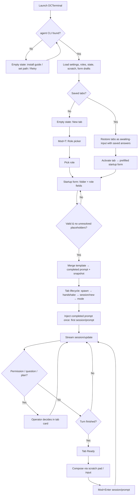
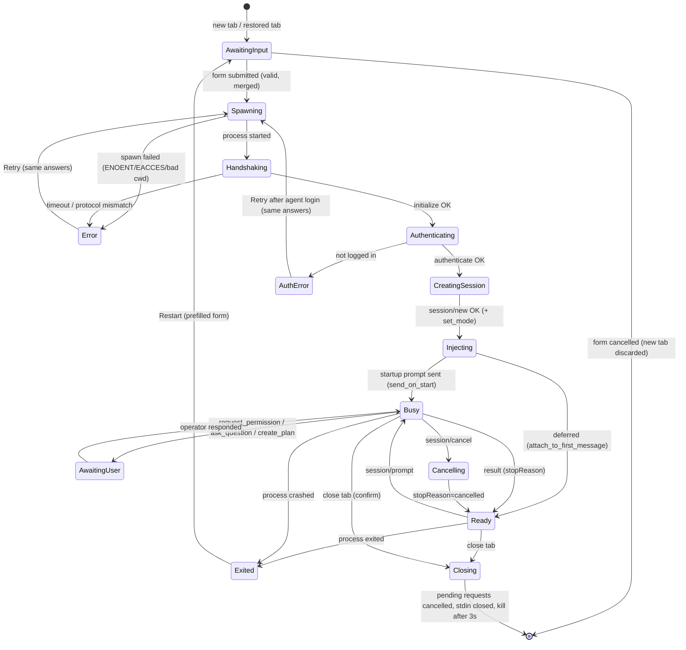
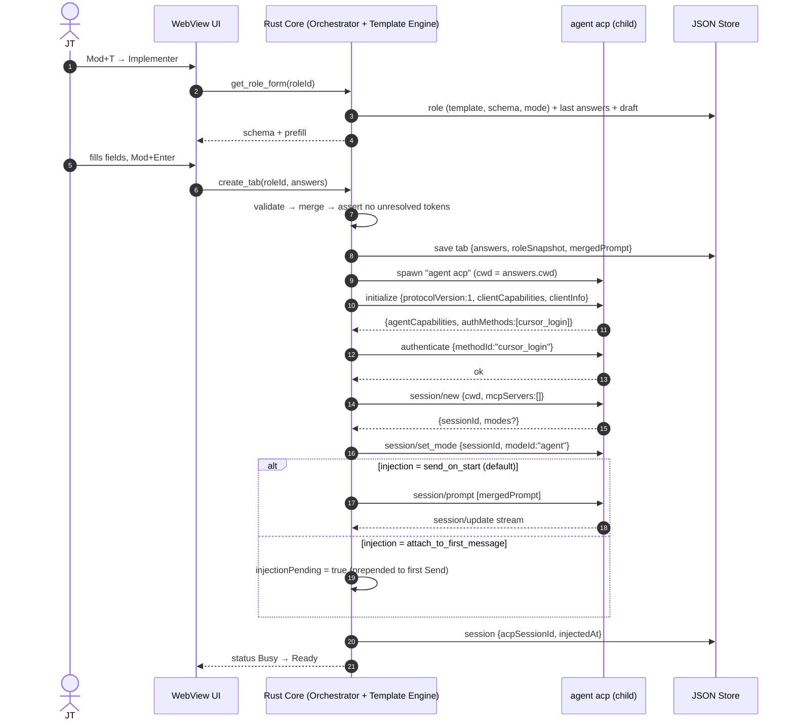
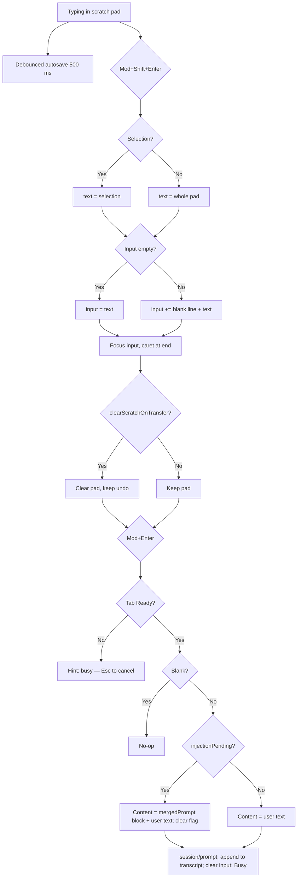
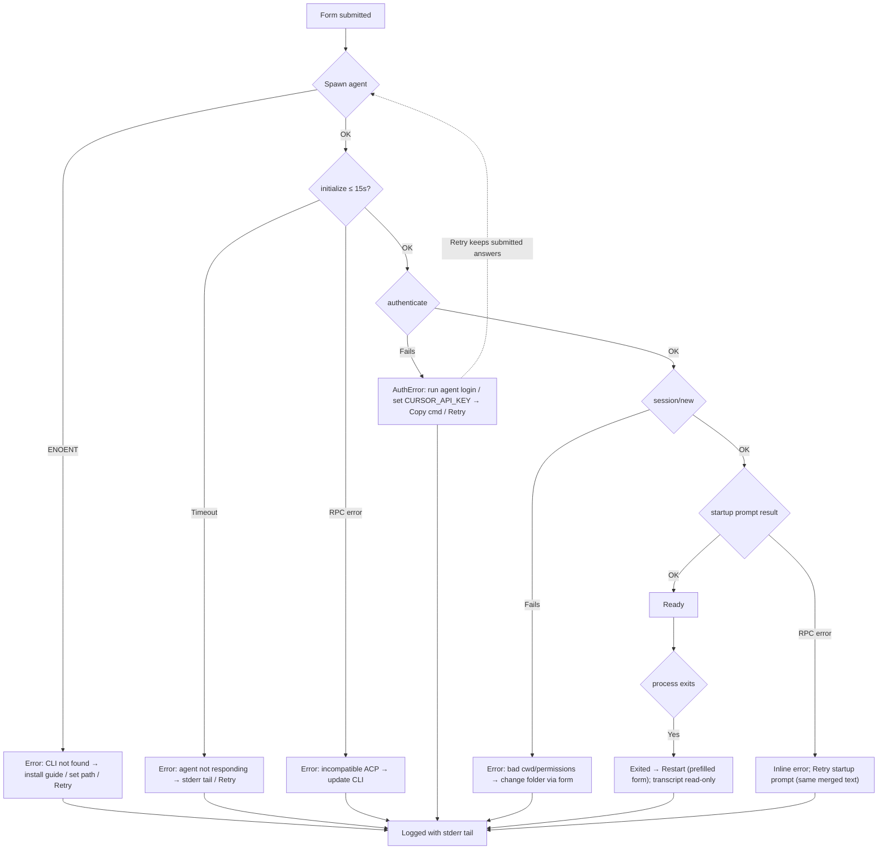
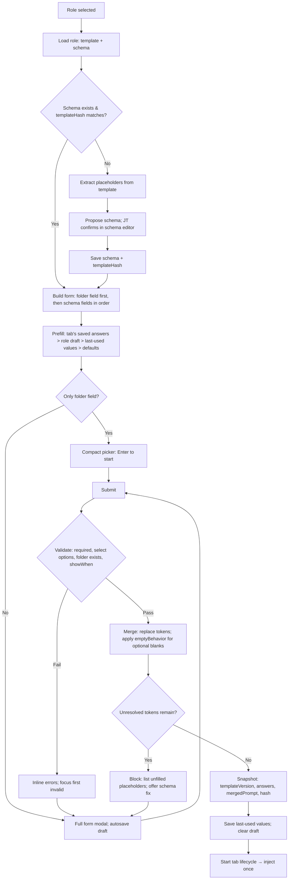
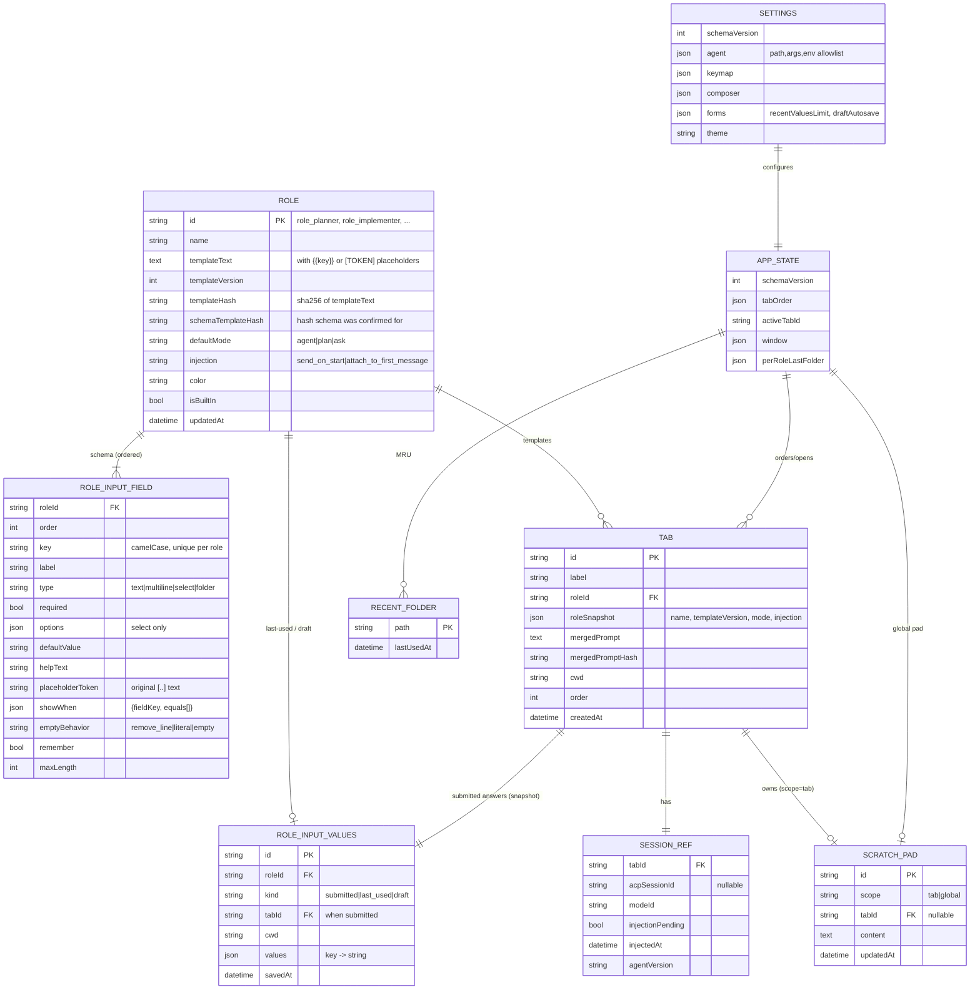
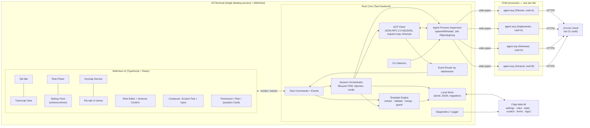

# DCTerminal — Final Project Blueprint

| Field | Value |
|---|---|
| Product | **DCTerminal**: a local desktop app that puts a role-aware, multi-tab UI on top of the Cursor CLI, using ACP (`agent acp`) |
| Owner / sole user | JT Francisco |
| Future code location | `C:\Users\user\Documents\Projects\DCTerminal` (empty today) |
| Document status | Final blueprint (Phases 6–27 condensed). **Planning only, no code.** |
| Date | 2026-10-05 |
| Protocol baseline | Cursor CLI ACP: JSON-RPC 2.0 over stdio, newline-delimited; `protocolVersion: 1` (per cursor.com/docs/cli/acp) |

> **How to read this:** sections 1–11 cover the *what* and *why*. Sections 12–20 cover the *how*. Sections 21–30 cover *when, risk, and decisions*. Every feature traces back to a user problem (see §7.3, Traceability Matrix).
>
> **2026-10-06 addendum:** §31 records decisions that are not to be reopened. §32 is the ADE-controls adoption order. §33 is the operational edge-case and failure-handling behavior the app implements.

---

## 1. Project Summary

DCTerminal is a small cross-platform desktop app (Windows, macOS, Linux) for working with the Cursor agent. Each **tab** is its own agent session with its own **role** (PR Reviewer, Developer, Planner, General, Implementer), its own **working directory**, and its own conversation.

When JT opens a role, DCTerminal first shows a **role startup form**. The form is generated from the placeholders in that role's prompt template (e.g. `[PASTE ORIGINAL TASK]`, `[SHORT TITLE]`). DCTerminal merges the answers into the template and **injects the completed prompt once** as the session starts. The working-folder field supports **browse**, **recent projects**, and **favorites**. A **scratch pad** with local persistence holds multiline drafts. Two hotkeys move the draft into the input box and send it.

DCTerminal does **not** emulate a terminal. Instead of scraping a PTY, it starts `agent acp` as a child process and speaks the Agent Client Protocol (ACP) over stdin/stdout. That gives structured streaming messages, tool calls, permission requests, plans, and todos. These are much more reliable to render than ANSI terminal output.

**Recommended stack:** Tauri 2 (Rust core with an OS WebView) plus a TypeScript/React UI, with JSON files for persistence. Expected infrastructure cost: $0.

---

## 2. Problem Statement

JT uses the Cursor CLI for several distinct kinds of work: planning, implementing approved plans, general development, reviewing PRs, and general Q&A. With the stock CLI:

1. **Role prompts are long templates that need filling in by hand every time.** JT has to copy the template, find each `[PLACEHOLDER]`, paste the task, plan, and title, then paste the whole thing into the terminal. Placeholders are easy to miss, which degrades the agent's output.
2. **Parallel work means several terminal windows.** Each window has to be set up again (cd, start the agent, paste the persona), and it is easy to lose track of which window does what.
3. **Writing multiline prompts in a terminal is painful.** Enter submits too early, editing is clumsy, and drafts are lost when the window closes.
4. **Terminal output is unstructured.** Permission prompts, plans, and tool calls are mixed into scrolling text.

**Core problem:** *"I want role-specific Cursor agent sessions, each started from a correctly filled template in the right project folder, side by side in one window, with good prompt drafting. I don't want to rebuild that context every time."*

---

## 3. Goals

| ID | Goal | Measure of success |
|---|---|---|
| G1 | Open a fully configured role session quickly | New tab → pick role → fill form (folder plus fields) → session running. No manual template editing. |
| G2 | No unfilled placeholders reach the agent | 100% of required fields validated before the session starts. Merged prompt previewable. |
| G3 | Inject the role prompt automatically, once per session | Every new session gets exactly one injection. JT never pastes templates. |
| G4 | Run several isolated sessions in one window | ≥ 6 concurrent tabs without UI lag; a crash in one tab does not affect the others |
| G5 | Make multiline prompt drafting comfortable and persistent | Scratch pad survives app restart and crash (≤ 1 s loss) |
| G6 | Keyboard-first flow | Form, scratch, transfer, and send all work without the mouse |
| G7 | Run identically on Windows, macOS, and Linux | One codebase with three installers |
| G8 | Stay small and maintainable by one person | Installer < 20 MB, UI idle RAM < 150 MB (excluding agent processes) |

---

## 4. Non-Goals

| Non-goal | Rationale |
|---|---|
| Full PTY terminal emulator (xterm.js plus shell) | ACP gives structured data. A PTY doubles the scope. This may come back later as an *optional* panel (§22). |
| Rebuilding the Cursor IDE (file tree, editor, diff editor) | The Cursor IDE or VS Code already does this |
| Multi-user, accounts, sync, or a cloud backend | Solo local tool. Zero infrastructure. |
| Managing Cursor authentication or billing | The Cursor CLI owns auth (`agent login`). DCTerminal detects and guides. |
| A general-purpose templating language (loops, conditionals in prompts) | Placeholder substitution plus simple conditional fields covers the five templates. Anything more is scope creep. |
| Fetching PR or ticket data automatically (GitHub/Jira) for form fields | Paste-in is enough for the MVP. Auto-fill is a P3 integration. |
| Supporting other ACP agents in v1 | Kept possible (the agent command is configurable) but not tested |
| Microservices, containers, servers | Out of proportion for a desktop utility |

---

## 5. Target Users

**Primary (and only) user: JT Francisco.** A developer and power user who:
- already has the Cursor CLI installed and authenticated;
- runs a **plan → implement → review** pipeline across repos (Planner produces a plan, Implementer executes the approved plan, PR Reviewer checks the result against the original task and plan), plus Developer and General sessions for ad-hoc work;
- prefers the keyboard and is comfortable editing JSON config;
- uses Windows mainly but wants the same tool on macOS and Linux.

**Implication:** optimize for speed, correctness of the startup context, and control. No onboarding wizard beyond CLI detection.

---

## 6. User Roles

DCTerminal has one **human role** and five **agent personas**. Personas are data (a template, an input schema, and a default mode), not code paths.

### 6.1 Human operator
| Role | Description |
|---|---|
| **Operator (JT)** | Owns everything: creates tabs, fills startup forms, edits role templates and schemas, approves or rejects agent tool permissions, accepts plans. |

### 6.2 Agent personas (built-in, editable; full prompt text supplied by JT)

| Persona | Purpose | Startup form fields (derived from template placeholders) | Default ACP mode | Notes |
|---|---|---|---|---|
| **Planner** | Turn a feature request or bug into an implementation plan | Working folder · **Task Type** (select) · **Title** · **Request / Problem** · **Expected Behavior** · **Current Behavior** (shown for Bug) · Additional Context (optional) | `plan` (read-only) | Complements Cursor plan mode. Renders `cursor/create_plan` approval. Its output feeds Implementer and PR Reviewer. |
| **Implementer** (plan executor) | Execute an *approved* plan faithfully | Working folder · **Task Type** · **Title** · **Description** · **Approved Implementation Plan** (long) · Additional Context (optional) | `agent` (full tools) | Full access: write, shell, and MCP are auto-allowed for this role. |
| **PR Reviewer** | Review the implementation against the original task and plan | Working folder · **Original Task** (long) · **Approved Implementation Plan** (long) · Additional Context (optional) | `agent` + write-deny policy | May run shell commands and use MCP; file writes stay blocked by role policy (not by prompt text alone). |
| **Developer** | General hands-on coding and onboarding to a codebase | Working folder (plus any template placeholders; likely none or minimal) | `agent` (full tools) | Full access: write, shell, and MCP are auto-allowed. Form is typically just the folder. |
| **General** | Ongoing free-form Q&A and scratch work | Working folder only (lightest form) | `ask` | A long-lived "just a tab" |

> **Challenge 1: prompts are not guardrails.** A "PR Reviewer" prompt telling the agent not to edit files is a suggestion, not a control. Real enforcement comes from **ACP session mode**, **per-role permission policy** (e.g. auto-allow shell for Reviewer, auto-deny writes), and operator overrides. Every role stores a template, a schema, a default mode, *and* a permission policy.
>
> **Challenge 2: the plan hand-off is manual copy/paste.** Planner → Implementer → PR Reviewer pass the same "Approved Implementation Plan" text around. The MVP supports this by remembering recent field values (FR-097). A P2 feature, **"Start Implementer/Reviewer from this plan"**, pre-fills the next role's form from an accepted `cursor/create_plan` in a Planner tab (FR-099). That closes the loop without heavy integration.

### 6.3 Permission matrix

Single user, so the matrix covers *what each persona's session may do by default*. These are **suggested defaults, all editable per role.**

| Capability | Operator | Planner | Implementer | PR Reviewer | Developer | General |
|---|---|---|---|---|---|---|
| Create, close, or rename tabs. Fill forms. | ✅ | — | — | — | — | — |
| Edit role templates, schemas, settings | ✅ | — | — | — | — | — |
| Read workspace files (agent tool) | approves | ✅ | ✅ | ✅ | ✅ | ✅ |
| Write or edit files | approves | ❌ (`plan`) | ✅ | ❌ (policy) | ✅ | ❌ (`ask`) |
| Run shell commands | approves | ❌ | ✅ | ✅ | ✅ | ❌ |
| MCP tools (`.cursor/mcp.json`) | approves | ✅ | ✅ | ✅ | ✅ | ✅ |
| Approve plans (`cursor/create_plan`) | ✅ | (requests it) | — | — | — | — |
| "Allow always" for a tool | ✅ explicit click only | — | — | — | — | — |

✅ allowed (role may do this; DCTerminal auto-allows these tool calls for that role) · ⚠️ needs a per-call operator decision · ❌ blocked by mode or role policy.

**JT decision (2026-10-05):** Implementer and Developer are allowed on **anything** (write, shell, MCP). PR Reviewer may **run shell commands** and use MCP, but still must not edit files. **All roles** may use MCP. Planner stays in `plan` (no write/shell). General stays in `ask` (no write/shell) but MCP is allowed.

---
## 7. Functional Requirements

Priority key: **P0** = MVP blocker · **P1** = MVP, can slip one iteration · **P2** = soon after MVP · **P3** = nice to have.

### 7.1 Requirements

#### Agent connection & sessions
| ID | Requirement | Priority |
|---|---|---|
| FR-001 | Detect the Cursor CLI `agent` executable (settings override → PATH → known install dirs → login-shell PATH on macOS/Linux) and show its version | P0 |
| FR-002 | Spawn `agent acp` as a child process with a per-tab working directory (`cwd`) | P0 |
| FR-002a | **Working-folder picker** on every role form: browse dialog + path text field; required before session start | P0 |
| FR-002b | **Recent projects**: remember last N (default 20) distinct folders used as tab cwd; show in a dropdown under the picker | P0 |
| FR-002c | **Favorite projects**: star/unstar folders; favorites always appear above recent; persist in settings JSON | P0 |
| FR-002d | Selecting a recent or favorite fills the working-folder field (does not start the session by itself) | P0 |
| FR-003 | ACP handshake: `initialize` (protocolVersion 1, clientInfo, capabilities) → `authenticate` (`methodId: "cursor_login"`) | P0 |
| FR-004 | Create a session with `session/new {cwd, mcpServers: []}` | P0 |
| FR-005 | Send prompts via `session/prompt`, and show `stopReason` on completion | P0 |
| FR-006 | Stream and render `session/update`: agent message chunks (Markdown), thought chunks (collapsible), tool calls with status, plan entries, mode updates | P0 |
| FR-007 | Handle `session/request_permission` with a card in the owning tab. Return the chosen option (`allow-once`, `allow-always`, `reject-once`). Never let a request hang silently. | P0 |
| FR-008 | Cancel an in-flight turn via `session/cancel` (button plus Esc) | P0 |
| FR-009 | Apply the role's default mode (`agent`/`plan`/`ask`) after session creation. Allow changing it per tab. | P1 |
| FR-010 | Cursor extensions: `cursor/create_plan` (accept/reject UI), `cursor/ask_question` (choice UI), display `cursor/update_todos` and `cursor/task`, link `cursor/generate_image` | P1. The P0 minimum is to always *reply* to blocking ones (`skipped`/`cancelled`) so the agent never deadlocks. |
| FR-011 | Reply JSON-RPC `-32601` to any unknown agent→client *request* | P0 |
| FR-012 | Resume previous sessions via `session/load` when `loadSession` is advertised | P2 |
| FR-013 | Browse past sessions via `session/list` (if advertised) | P3 |

#### Roles (templates)
| ID | Requirement | Priority |
|---|---|---|
| FR-020 | Seed **five** built-in roles: Planner, Implementer, PR Reviewer, Developer, General. Each has JT's full template text, an input schema, a default mode, and a color. Shipped via `roles.seed.json`. | P0 |
| FR-021 | Edit a role's name, template text (multiline), default mode, color, and input schema. Changes persist. | P0 (template, mode) / P1 (schema editor UI) |
| FR-022 | Inject the **completed** role prompt (template merged with form answers) **exactly once per session**, at session start (§16.4). Never auto-resend within a session. | P0 |
| FR-023 | Show the active role in the tab label (color chip plus name plus title field if present) and in the session header | P0 |
| FR-024 | Create, duplicate, or delete custom roles. Built-ins can be reset but not deleted. | P2 |
| FR-025 | Snapshot the template version, the form answers, **and the final merged prompt** into the tab record, so later edits don't misrepresent what the agent was told | P0 |
| FR-026 | "Re-inject role" manual command for long sessions where the persona drifts | P3 |
| FR-027 | Export or import roles (template plus schema) as JSON | P3 |

#### Role startup input forms (ESSENTIAL MVP)
| ID | Requirement | Priority |
|---|---|---|
| FR-090 | **Placeholder extraction:** parse each role template for placeholder tokens (§16.5 grammar: legacy `[UPPER CASE…]` brackets and canonical `{{key}}`). Produce a proposed **RoleInputSchema** (ordered fields). | P0 |
| FR-091 | **Schema confirmation:** when a template is imported or edited, show the detected fields and let JT confirm, rename the label, set the type (`text`, `multiline`, `select`, `folder`), set required/optional, add help text, set select options, and choose whether to **convert** the bracket tokens to canonical `{{key}}` tokens. The confirmed schema is stored with the role. | P0 (auto-detect plus stored schema, JSON-editable) / P1 (schema editor UI) |
| FR-092 | **Startup form:** opening a role (new tab, or restarting a tab whose session ended) shows a modal form generated from the schema. **The working folder is always the first field.** The ACP session does **not** start until the form is submitted. | P0 |
| FR-093 | **Validation:** required fields must be non-blank (after trimming). Select fields need a valid option. The folder must exist. Errors appear inline and Submit stays disabled until the form is valid. Optional empty fields follow the field's `emptyBehavior` (§16.5). | P0 |
| FR-094 | **Conditional fields:** a field may declare `showWhen` (e.g. Planner "Current Behavior" only when Task Type = Bug). Hidden fields are not required and render as their empty value. | P1 (P0 fallback: always show, mark optional) |
| FR-095 | **Merge:** substitute answers into the template deterministically (§16.5). Before injection, verify that **no unresolved placeholders** remain. If any do, block with "Unfilled: [X]". | P0 |
| FR-096 | **Preview:** a "Preview prompt" toggle in the form shows the final merged prompt (read-only, with a copy button) and its character and approximate token count | P1 |
| FR-097 | **Recall:** prefill fields from the last submission for that role (per field, configurable `remember: true/false`). Offer a "recent values" dropdown for long fields like Approved Implementation Plan (last 5). | P1 |
| FR-098 | **Large paste support:** multiline fields accept 100k+ characters (plans, task descriptions) with a monospace editor, plus "Load from scratch pad" and "Paste from clipboard" buttons | P0 (multiline) / P1 (buttons) |
| FR-099 | **Plan hand-off:** on a finished Planner turn, **Send to Implementer** (plan card, final assistant message, and command palette) opens an Implementer tab in the same folder. JT chooses the latest plan plus to-dos (default), the whole latest plan message, the plan card, or a selection. The text is mapped onto the Implementer's own fields (task type, title, description, approved plan, additional context). **Send to Developer** uses the same hand-off; Developer has no plan field, so the text lands in that tab's scratch pad. Nothing starts until Start. The record (plan text, source tab, folder, timestamp) is stored in app data. The new tab shows **From Planner: title**, linking to the source tab or to the saved plan if that tab was closed. PR Reviewer fields use the same map; there is no separate Reviewer button yet. | P2, shipped for Implementer and Developer |
| FR-100 | **Restart semantics:** restarting or restoring a tab reopens the form **prefilled with that tab's saved answers**, so JT can confirm or adjust before the startup prompt runs again (no silent re-run) | P0 |
| FR-101 | **Lightweight roles:** if a role's schema has only the folder field (Developer, General), the form collapses to the compact role picker with no extra step. Enter starts immediately. | P0 |
| FR-102 | **Draft safety:** form input is autosaved as a draft (per role) while typing, so cancelling or crashing doesn't lose a pasted plan | P1 |

#### Tabs
| ID | Requirement | Priority |
|---|---|---|
| FR-030 | New tab → role picker → startup form → session | P0 |
| FR-031 | Each tab owns an independent agent process, filled prompt, and ACP session (§14.3) | P0 |
| FR-032 | Switch tabs by click or hotkey. Background tabs keep streaming. | P0 |
| FR-033 | Per-tab status: `awaiting-input` (form not submitted), `starting`, `ready`, `busy`, `awaiting-permission`, `error`, `exited` | P0 |
| FR-034 | Close a tab: cancel the active turn, reply `cancelled` to pending requests, stop the process gracefully then force. Confirm if busy. | P0 |
| FR-035 | Rename a tab. Default label: `<Role> · <Title field or folder name>`. | P1 |
| FR-036 | Restore the tab list (role, cwd, label, answers, order) on relaunch. Sessions are not auto-started. Each restored tab shows "Start session" (the prefilled form, FR-100), unless P2 `session/load` resumes it. | P1 |
| FR-037 | Drag-reorder tabs | P3 |
| FR-038 | Restart a crashed or exited tab's agent (via the prefilled form) | P0 |

#### Working directory
| ID | Requirement | Priority |
|---|---|---|
| FR-040 | Per-tab folder field in the startup form (native folder dialog) | P0 |
| FR-041 | MRU folders (max 10). Defaults to the last folder used with that role. | P1 |
| FR-042 | Validate the folder exists and is readable. Warn (informational) if it isn't a git repo. | P1 |
| FR-043 | A tab's cwd is immutable once its session starts. A different folder means a new tab. | P0 |

#### Scratch pad & input
| ID | Requirement | Priority |
|---|---|---|
| FR-050 | Multiline scratch pad, autosaved (debounced ~500 ms, plus a flush on blur and quit) | P0 |
| FR-051 | Scratch scope: per-tab pad plus a global pad (toggle) | P0 per-tab / P1 global |
| FR-052 | Multiline input box. Enter = newline, Mod+Enter = send (configurable). | P0 |
| FR-053 | **Transfer** hotkey: move the scratch selection (or the whole pad) into the input. Append with a blank-line separator if the input is non-empty. Focus moves to the input. The pad is kept by default. | P0 |
| FR-054 | **Send** hotkey: send the input to the active tab. Disabled while busy, with a hint. No queueing in the MVP. | P0 |
| FR-055 | Input history per tab | P2 |
| FR-056 | Named snippets in the scratch pad | P3 |

#### Settings, transcript, diagnostics
| ID | Requirement | Priority |
|---|---|---|
| FR-060 | Settings: agent path, extra args, env passthrough allowlist, theme, font, composer behavior, injection behavior | P1 |
| FR-061 | Editable keymap (JSON) with conflict detection. A UI for it later. | P1 / P2 |
| FR-062 | Light and dark themes (follow OS) | P2 |
| FR-070 | Copy a message or code block as Markdown | P1 |
| FR-071 | Export a transcript to `.md` (including the startup prompt) | P2 |
| FR-072 | Local transcript persistence | P3 |
| FR-080 | Per-tab log drawer: stderr plus optional JSON-RPC trace | P1 |
| FR-081 | Actionable auth-failure guidance (`agent login`, then Retry) | P0 |

### 7.2 Feature prioritization summary

| Priority | Features |
|---|---|
| **P0** | CLI detection · spawn/handshake/auth · session new/prompt/update/cancel · permissions · unknown-method safety · **5 built-in roles** · **placeholder extraction plus stored schema · startup form with validation · deterministic merge plus unresolved-placeholder guard · prefilled form on restart** · once-per-session injection · merged-prompt snapshot · tabs (new/switch/close/status/restart) · per-tab cwd · per-tab scratch pad · Transfer and Send hotkeys · auth guidance |
| **P1** | Mode per role/tab · Cursor plan/question UIs · schema editor UI · conditional fields · prompt preview · field recall · form drafts · tab restore · rename · MRU · settings · keymap JSON · copy · log drawer · global scratch |
| **P2** | session/load resume · plan hand-off to PR Reviewer (Implementer and Developer hand-off shipped, FR-099) · custom roles · keymap UI · input history · transcript export · themes · notifications |
| **P3** | session/list · re-inject · role import/export · snippets · drag-reorder · transcript persistence · auto-approve allowlists · PTY panel · GitHub auto-fill of fields |

### 7.3 Traceability matrix (User Problem → Requirement → Feature → Workflow → Architecture → Implementation Task)

| User problem | Requirement(s) | Feature | Workflow | Architecture component | Tasks (§23) |
|---|---|---|---|---|---|
| P1: Hand-filling long role templates, missed placeholders | FR-020–022, FR-025, FR-090–102 | Role templates, input schemas, startup form, merge, guard, preview | J1, J2, Flows C and F | Role Store · Template Engine · Startup Form UI · Session Orchestrator | T2.3, T2.8, T3.1, T3.2, T3.6 |
| P2: Juggling terminal windows | FR-030–038, FR-040–043 | Multi-tab, one agent per tab, per-tab cwd | J1, J4, Flow B | Tab Manager · Agent Process Supervisor | T1.2, T2.1, T3.4 |
| P3: Painful multiline prompting | FR-050–054, FR-098 | Scratch pad, Transfer/Send hotkeys, large-paste form fields | J3, Flow D | Scratch Store · Keymap Service · Composer UI | T2.4, T2.5, T4.1 |
| P4: Unstructured output | FR-006–011 | Structured stream renderer, permission/plan cards | J5, Flow A | ACP Client · Event Router · Transcript UI | T1.3, T2.6, T3.5 |
| P5: Opaque auth or install failures | FR-001, FR-081 | CLI detection, auth guidance | J6, Flow E | Supervisor · CLI Detector · Diagnostics | T1.1, T2.7 |

---

## 8. Non-Functional Requirements

| ID | Category | Requirement |
|---|---|---|
| NFR-01 | Performance | Cold start < 2 s to an interactive window. Tab switch < 100 ms. The form opens in < 150 ms. Merge plus validation < 10 ms for 200 KB templates. Streaming render ≥ 60 chunks/s (rAF-batched). |
| NFR-02 | Resource | UI shell < 150 MB idle. Each agent process is extra (expect ~100–300 MB; **measure in T0.2**). Soft warning above 8 tabs. |
| NFR-03 | Reliability | One tab's agent crash never affects others. Scratch pad and form drafts lose ≤ ~1 s on a hard crash. Atomic JSON writes. |
| NFR-04 | Portability | Windows 10/11 x64, macOS 12+ (arm64/x64), Linux x64 (Ubuntu 22.04+/Fedora). Feature parity. |
| NFR-05 | Security | No network listener. No telemetry. No credential storage. Strict CSP. Least-privilege Tauri capabilities. |
| NFR-06 | Usability | Every action is keyboard reachable, including form fields (Tab order, Mod+Enter submits the form). Platform-correct modifiers. |
| NFR-07 | Maintainability | < ~10k LOC MVP. Typed ACP messages isolated in one module. The template engine is a pure, unit-tested function. |
| NFR-08 | Compatibility | Tolerate unknown `session/update` kinds and fields. Log and continue. |
| NFR-09 | Data durability | Human-readable JSON with `schemaVersion` and `.bak`. Never silently delete prompts, templates, or answers. |
| NFR-10 | Determinism | The same template, schema, and answers always produce byte-identical merged prompts (testable, snapshot-able). |
| NFR-11 | Accessibility | OS font scaling. WCAG AA contrast. Labelled form controls and inline errors announced to screen readers. |
| NFR-12 | Observability | Rolling log (≤ 5 MB × 3). Optional JSON-RPC trace with prompt redaction. |

---

## 9. User Journeys

### J1: Start a Planner session for a bug (form-driven)
1. JT presses **Mod+T**. The role picker shows the five roles. He presses `1` (Planner).
2. **The Planner startup form opens.** Folder is prefilled with the last Planner folder. Task Type = `Bug`, so the "Current Behavior" field appears. He fills Title "Login 500 on expired token", Request/Problem, Expected Behavior, and Current Behavior. Additional Context is left empty (optional).
3. He optionally toggles **Preview** to see the merged prompt. No unresolved placeholders are reported.
4. **Mod+Enter** (Start session). The tab "Planner · Login 500 on expired token" appears in `starting`.
5. DCTerminal spawns `agent acp` in the folder → initialize → authenticate → session/new → set mode `plan` → **sends the completed prompt as the first turn**.
6. The agent investigates and returns a plan via `cursor/create_plan`. JT reviews it and clicks **Accept**.

### J2: Implement, then review (the pipeline)
1. When the Planner turn finishes, JT clicks **Send to Implementer** (or picks it from the command palette). He keeps the default, latest plan plus to-dos, and confirms. A new Implementer tab opens on the same folder with the form already filled. He edits it and presses **Start**. The agent does not start before that.
2. The Implementer form shows Task Type, Title, Description, **Approved Implementation Plan**, and Additional Context, mapped from the Planner answers and the chosen plan text. He submits, and the Implementer tab starts in `agent` mode and begins executing. He approves permission prompts for edits and `npm test` as they come. The tab keeps a **From Planner: title** link back to the Planner tab.
3. When it finishes, Mod+T → PR Reviewer. The form asks for **Original Task** and **Approved Implementation Plan** (both recall-prefilled) plus Additional Context. He submits, and the reviewer starts in `agent` mode with write-deny policy (shell + MCP allowed), reviewing the working tree or branch.
4. Three tabs are now side by side: Planner, Implementer, Reviewer. Each has its own filled prompt and its own ACP session.

### J3: Draft a long follow-up prompt
1. **Mod+J** focuses the scratch pad. JT writes a 30-line follow-up, which autosaves.
2. He selects part of it (or nothing, meaning everything) and presses **Mod+Shift+Enter** (Transfer). The text lands in the input and focus moves there.
3. **Mod+Enter** sends it. The scratch pad keeps its content.

### J4: Lightweight General or Developer tab
1. Mod+T → `5` (General). The schema has only the folder, so the compact picker is enough. He confirms the folder with Enter.
2. The session starts and the General template is injected once. The tab is ready for ongoing Q&A.

### J5: Permission request in a background tab
1. While JT is in the Reviewer tab, the Implementer wants to run a migration. Its tab badge turns ⚠.
2. JT presses **Mod+2** to jump there. The card shows the command and cwd. **A** = allow once, **R** = reject.

### J6: First run / auth failure
1. CLI missing: an empty state with install guidance, "Set path…", and Retry.
2. CLI present but not logged in: after the form is submitted, the tab shows **AuthError**: "Run `agent login` (or set CURSOR_API_KEY), then Retry". **Retry reuses the submitted answers.** No re-filling.

### J7: Relaunch the app
1. Tabs are restored as `awaiting-input` with their answers saved.
2. Activating one shows "Start session" (the prefilled form). JT confirms and the startup prompt runs again in a fresh session. With P2 `session/load`, the old conversation is resumed instead, with no re-injection.

---
## 10. Flowcharts

### 10.A Main workflow


### 10.B Tab lifecycle (state machine)


### 10.C Role session start (sequence)


### 10.D Scratch pad → input → send


### 10.E Error / auth failure handling


### 10.F Role startup form → merge → session start


---

## 11. Wireframes (ASCII)

### 11.1 Main window with tabs
```
┌──────────────────────────────────────────────────────────────────────────────────┐
│ DCTerminal                                                         ─  ☐  ✕      │
├──────────────────────────────────────────────────────────────────────────────────┤
│[●Plan·Login 500 ✓][●Impl·Login 500 ⟳][●Review·Login 500 ⚠][●Dev·api][●General][+]│
├──────────────────────────────────────────────────────────────────────────────────┤
│ Implementer · mode: agent ▾ · C:\Users\user\code\api-server                      │
│ Title: Login 500 on expired token    [View startup prompt] [Restart] [Log] [⋯]  │
├───────────────────────────────────────────────────────┬──────────────────────────┤
│ ▸ Startup prompt (Implementer v3, 4 fields) — sent    │ SCRATCH PAD (this tab) ▾ │
│                                                       │ ┌──────────────────────┐ │
│ AGENT ───────────────────────────────────────────     │ │ Follow-up: also add  │ │
│ Following the approved plan. Step 1/5: inspect the    │ │ a regression test    │ │
│ token middleware.                                     │ │ for refresh flow...  │ │
│ ┌ 🔧 read_file src/middleware/auth.ts      ✓ done ─┐  │ │                      │ │
│ └──────────────────────────────────────────────────┘  │ └──────────────────────┘ │
│ ┌ 🔧 edit src/middleware/auth.ts            ✓ done ─┐  │ saved ✓ · 6 lines        │
│ ┌ 🔧 run: npm test                   ⏳ running   ─┐  │ [⇩ Transfer Mod+Shift+↵] │
│ ☐ Todos: ✓ inspect  ⟳ fix  ○ test  ○ docs              │                          │
├───────────────────────────────────────────────────────┴──────────────────────────┤
│ ┌──────────────────────────────────────────────────────────────────────────────┐ │
│ │ Type a message… (Enter = newline, Mod+Enter = send)                          │ │
│ └──────────────────────────────────────────────────────────────────────────────┘ │
│ ● Busy · Esc to cancel                              [■ Cancel]   [Send Mod+↵]   │
└──────────────────────────────────────────────────────────────────────────────────┘
 Tab glyphs: ⟳ busy · ⚠ needs decision · ✓ finished in background · ✕ error · ✎ awaiting input
```

### 11.2 Role picker (step 1 of new tab)
```
┌──────────────────────── New Tab ─────────────────────────┐
│  Choose a role                                            │
│ ▶ (1) ● Planner       plan   · 6 fields                  │
│   (2) ● Implementer   agent  · 5 fields                  │
│   (3) ● PR Reviewer   ask    · 3 fields                  │
│   (4) ● Developer     agent  · folder only               │
│   (5) ● General       ask    · folder only               │
│                                         [Edit roles…]     │
│ ───────────────────────────────────────────────────────── │
│  Folder (for folder-only roles):                          │
│   ▶ C:\Users\user\code\api-server         (last used)     │
│     C:\Users\user\code\web-app      [Browse…]             │
│                                                           │
│          [Cancel Esc]   [Next ↵]  (or Start for 4/5)      │
└───────────────────────────────────────────────────────────┘
```

### 11.3 Role startup form modal (Planner example, with Bug conditional)
```
┌──────────────── Start Planner session ─────────────────────────────── ✕ ┐
│ Working folder *   [C:\Users\user\code\api-server            ][Browse…] │
│                    ⓘ git repo · branch: main                             │
│ Task Type *        [ Bug                                  ▾ ]            │
│                      Feature · Bug · Refactor · Chore                    │
│ Title *            [ Login 500 on expired token               ]          │
│ Request / Problem *┌──────────────────────────────────────────────────┐  │
│                    │ Users with expired tokens get HTTP 500 instead   │  │
│                    │ of a 401 + refresh.                              │  │
│                    └──────────────────────────────────────────────────┘  │
│ Expected Behavior *┌──────────────────────────────────────────────────┐  │
│                    │ Return 401, client refreshes silently.           │  │
│                    └──────────────────────────────────────────────────┘  │
│ Current Behavior * ┌──────────────────────────────────────────────────┐  │
│  (shown for Bug)   │ Unhandled TokenExpiredError → 500.               │  │
│                    └──────────────────────────────────────────────────┘  │
│ Additional Context ┌──────────────────────────────────────────────────┐  │
│  (optional)        │                                                  │  │
│                    └──────────────────────────────────────────────────┘  │
│                    [Paste] [From scratch pad] [Recent ▾]                 │
│ ──────────────────────────────────────────────────────────────────────── │
│ ▸ Preview prompt (3,214 chars · ~800 tokens) · 0 unfilled placeholders   │
│ Draft autosaved ✓              [Cancel Esc]   [Start session  Mod+Enter] │
└──────────────────────────────────────────────────────────────────────────┘
 * required · Tab/Shift+Tab moves between fields · Mod+Enter submits
```

### 11.4 Startup form: Implementer / PR Reviewer (validation state)
```
┌──────────────── Start PR Reviewer session ─────────────────────────── ✕ ┐
│ Working folder *   [C:\Users\user\code\api-server            ][Browse…] │
│ Original Task *    ┌──────────────────────────────────────────────────┐  │
│                    │                                                  │  │
│                    └──────────────────────────────────────────────────┘  │
│                    ✕ Required                       [Recent ▾]           │
│ Approved Implementation Plan *                                           │
│                    ┌──────────────────────────────────────────────────┐  │
│                    │ 1. Catch TokenExpiredError in auth middleware…   │  │
│                    │ 2. …                     (prefilled from last)   │  │
│                    └──────────────────────────────────────────────────┘  │
│ Additional Context (optional) [                                     ]    │
│ ──────────────────────────────────────────────────────────────────────── │
│ ⚠ 1 field needs attention          [Cancel]   [Start session] (disabled) │
└──────────────────────────────────────────────────────────────────────────┘
```

### 11.5 Schema confirmation (role editor, after template import/edit)
```
┌──────────── Edit role: Implementer ─── Template │ Fields │ Settings ──────┐
│ Detected 5 placeholders in template (v3):                                 │
│  #  Token in template                 Key            Label        Type     Req │
│  1  [FEATURE/BUG]                     taskType       Task Type    select ▾ ☑  │
│  2  [SHORT TITLE]                     title          Title        text   ▾ ☑  │
│  3  [DESCRIBE THE TASK]               description    Description  multi  ▾ ☑  │
│  4  [PASTE APPROVED PLAN]             approvedPlan   Approved…    multi  ▾ ☑  │
│  5  [ADDITIONAL CONTEXT, OPTIONAL]    additionalCtx  Additional…  multi  ▾ ☐  │
│  Select options for taskType: [Feature, Bug, Refactor, Chore]             │
│  ☑ Convert tokens to {{key}} in template (recommended)                    │
│  ⚠ Ignored (not placeholders): "[ ]" checklist ×3, "[link](…)" ×1         │
│                                            [Cancel]   [Save fields]       │
└───────────────────────────────────────────────────────────────────────────┘
```

### 11.6 Scratch pad + input (bottom-docked variant)
```
┌──────────────────────────────────────────────────────────────────────────┐
│ SCRATCH PAD  [This tab ▾ | Global]                       saved ✓ 23:41   │
│ ┌──────────────────────────────────────────────────────────────────────┐ │
│ │ ## Review follow-ups                                                 │ │
│ │ ███ Check error handling in PaymentService ███  ← selected           │ │
│ │ - Verify migration is reversible                                     │ │
│ └──────────────────────────────────────────────────────────────────────┘ │
│   Mod+Shift+Enter: transfer selection (or all) ▼                         │
│ ┌ INPUT ───────────────────────────────────────────────────────────────┐ │
│ │ Please re-check after the latest commit.                             │ │
│ │                                                                      │ │
│ │ Check error handling in PaymentService     ← appended                │ │
│ └──────────────────────────────────────────────────────────────────────┘ │
│   3 lines · ~40 tokens                           [Send  Mod+Enter]       │
└──────────────────────────────────────────────────────────────────────────┘
```

### 11.7 Empty / loading / error / permission states
```
EMPTY (no tabs)                          LOADING (tab starting)
┌──────────────────────────────────┐     ┌──────────────────────────────────┐
│        No sessions open          │     │  Implementer · Login 500         │
│   [+ New tab   Mod+T]            │     │   ✓ Form submitted (5 fields)    │
│   Recent:                        │     │   ✓ Agent started                │
│   • Planner · Login 500          │     │   ✓ Connected (ACP v1)           │
│   • Dev · api-server             │     │   ⟳ Authenticating…              │
│   Cursor CLI: agent 2026.x ✓     │     │   ○ Creating session (mode agent)│
└──────────────────────────────────┘     │   ○ Sending startup prompt       │
                                         │   [Cancel]   [Show log]          │
RESTORED TAB (awaiting input)            └──────────────────────────────────┘
┌──────────────────────────────────┐
│ ✎ Planner · Login 500            │     ERROR: NOT AUTHENTICATED
│ Session not running.             │     ┌──────────────────────────────────┐
│ Saved answers: 6 fields          │     │ ✕ Cursor CLI is not logged in    │
│ [Start session…] (opens form)    │     │   agent login          [Copy]    │
│ ⓘ Re-runs the startup prompt     │     │ or set CURSOR_API_KEY.           │
└──────────────────────────────────┘     │ Your form answers are kept.      │
                                         │          [Retry]  [Show log]     │
ERROR: CLI NOT FOUND                     └──────────────────────────────────┘
┌──────────────────────────────────┐
│ ✕ Cursor CLI ("agent") not found │     PERMISSION REQUEST (inline card)
│ Install it, then click Retry:    │     ┌──────────────────────────────────┐
│  macOS/Linux:                    │     │ ⚠ Implementer wants to run:      │
│   curl https://cursor.com/install│     │   npm run migrate                │
│        -fsS | bash               │     │   in C:\…\api-server             │
│  Windows: see Cursor CLI docs    │     │ [Allow once A] [Allow always]    │
│ [Set path manually…]   [Retry]   │     │ [Reject R]                       │
└──────────────────────────────────┘     └──────────────────────────────────┘

AGENT EXITED
┌──────────────────────────────────┐
│ ⚠ Agent process exited (code 1)  │
│ Transcript kept (read-only)      │
│ [Restart…] (prefilled form) [Log]│
└──────────────────────────────────┘
```

---

### Working folder, recent projects, favorites (MVP)

- Each **Tab** stores `cwd` (absolute path).
- **AppSettings** (or a sibling `projects.json`) stores:
  - `recentProjects: [{ path, lastUsedAt }]` — capped list (default 20), most-recent first
  - `favoriteProjects: [{ path, label? }]` — user-starred, ordered
- Picker UX: text field + Browse… + dropdown sections **Favorites** then **Recent**.
- Starring is available from the picker and from an open tab’s folder chip.
- Invalid/missing paths stay listed but show a warning until fixed or removed.

## 12. Domain Model

| Entity | Responsibility | Key attributes | Lifetime |
|---|---|---|---|
| **Role** | Persona template | id, name, templateText, templateVersion, templateHash, defaultMode, injection (`send_on_start` \| `attach_to_first_message`), color, isBuiltIn | Persistent |
| **RoleInputSchema** | Ordered form definition for a role | roleId, templateHash (the template it was confirmed against), fields[] | Persistent (embedded in Role) |
| **RoleInputField** | One form field bound to a template placeholder | key, label, type (`text` \| `multiline` \| `select` \| `folder`), required, options[], default, helpText, placeholderToken (original `[…]` text), showWhen {fieldKey, equals[]}, emptyBehavior (`remove_line` \| `literal:"None"` \| `empty`), remember (bool), maxLength | Persistent |
| **RoleInputValues** (answers) | One submission of a form | roleId, values {key → string}, cwd, submittedAt | Persisted on the Tab. "Last used" per role. Draft per role. |
| **MergedPrompt** | Result of template ⨉ answers | text, sha256, charCount, unresolvedTokens[] (must be empty) | Snapshot on the Session |
| **Tab** | UI container; owns one AgentConnection and one Session | id, label, roleId, roleSnapshot, answers, cwd, order, status, scratchPadId | Persistent metadata, runtime status |
| **AgentConnection** | One `agent acp` child process plus JSON-RPC channel | pid, agentVersion, capabilities, pending requests | Runtime |
| **Session** | One ACP session | acpSessionId, modeId, injection {strategy, pending, injectedAt, mergedPromptHash} | Ref persisted |
| **Turn** | One `session/prompt` round trip | text, isStartup, startedAt, stopReason | Runtime (P3 persisted) |
| **TranscriptItem** | Rendered event | kind (user, startup_prompt, agent_text, thought, tool_call, plan, todos, permission, error), payload | Runtime (P3 persisted) |
| **PermissionRequest / AgentQuestion / PlanApproval** | Pending agent→client requests | jsonRpcId, payload, decision | Runtime |
| **ScratchPad** | Persistent multiline text | id, scope (tab \| global), tabId, content, updatedAt | Persistent |
| **Settings** | Preferences and keymap | agent path/args/env, keymap, composer, theme | Persistent |
| **AppState** | Layout | tab order, activeTabId, window, MRU folders, perRoleLastFolder | Persistent |

**Invariants**
1. A Tab cannot leave `AwaitingInput` until its RoleInputValues validate against the schema **and** the MergedPrompt has zero unresolved tokens.
2. Each Session auto-injects its MergedPrompt **at most once** (`injectedAt` set ⇒ never again).
3. Role, answers, merged prompt, and cwd are frozen per session (snapshot). Editing the role later does not change running tabs.
4. A Tab has at most one in-flight Turn.
5. Every agent→client JSON-RPC request receives exactly one response.
6. A schema is valid only for the template hash it was confirmed against. If the template changes, re-extraction and confirmation are required before the next session start (fields with unchanged tokens carry over automatically).

---

## 13. ERD (local data)



---

## 14. System Architecture

### 14.1 Component diagram


### 14.2 Responsibilities and boundaries
- **The UI never touches processes or files.** It uses typed Tauri commands and events only.
- **The Template Engine is a pure Rust module** (no IO). It provides `extract(template) → ProposedSchema`, `validate(schema, values) → Errors`, and `merge(template, schema, values) → MergedPrompt{text, unresolved[]}`. It is deterministic and exhaustively unit-tested. The UI calls it through commands for live preview, so there is one implementation and no TS/Rust drift.
- **The ACP client is the only module that knows JSON-RPC.** It emits typed domain events.
- **Session Orchestrator** owns the lifecycle FSM (§10.B), refuses to start without a valid MergedPrompt, and enforces once-only injection.
- **Supervisor** owns OS-specific spawning (Windows `.cmd` shims, macOS GUI PATH) and guarantees no orphans.

### 14.3 Multi-tab → ACP mapping (key decision)

ACP lets one agent process host several sessions, each with its own `cwd`. Options:

| Option | Description | Pros | Cons |
|---|---|---|---|
| **A. One process per tab** *(recommended)* | Each tab spawns `agent acp` with process cwd = the tab folder, and creates one session | Crash and hang isolation. A 1:1 mental model. Project-scoped `.cursor/mcp.json` and rules resolve from the launch dir (Cursor docs advise launching from the project dir). Killing a process gives a clean stop. | ~100–300 MB per tab (to be measured). Spawn latency per tab. |
| B. One shared process, N sessions | `session/new {cwd}` per tab on a single process | Lower memory, faster tabs | A single crash kills all tabs. MCP/config resolved from the process dir. A single pipe is a bottleneck. Less proven. |
| C. One process per folder | Tabs on the same folder share a process | Middle ground | Bookkeeping complexity for little gain |

**Decision (ADR-003):** A. The ACP client routes everything by `sessionId` anyway, so switching to B or C later is a Supervisor change. **Memory mitigation:** restored tabs are not spawned until JT starts them (they wait in `AwaitingInput`), and there is a soft warning above 8 running tabs.

**Mapping summary:** `Tab 1 ⇄ 1 agent acp process ⇄ 1 ACP sessionId ⇄ 1 role snapshot + 1 answers set + 1 merged prompt + 1 cwd + 1 scratch pad`.

### 14.4 Working directory per tab
- The folder is the **first field of every startup form** (type `folder`, required). It is prefilled from that role's last folder, then the global MRU.
- Stored as an absolute, normalized path. On Windows, warn on UNC paths.
- Used as **both** the child process `cwd` **and** `session/new.cwd`.
- Immutable for the tab's life. A different folder means a new tab (or Restart → form → new folder, which creates a new session).
- Missing on restore: the form shows "Folder not found" and requires a new pick.
- Optional template variable `{{cwd}}` (and `{{folderName}}`) is available to templates automatically, so prompts can reference the project path without a manual field.

---

## 15. Technology Stack

### 15.1 Recommendation

| Layer | Choice | Why | Trade-offs | Alternatives | MVP necessity |
|---|---|---|---|---|---|
| Desktop shell | **Tauri 2.x** | ~5–15 MB installers, low idle RAM (OS WebView), Rust process control, built-in bundlers (NSIS/MSI, DMG, AppImage/deb/rpm), capability-based security | WebView variance (WebView2 / WKWebView / WebKitGTK). Rust learning curve. | **Electron** (fastest to build; Node `child_process` plus official ACP TS SDK; but 80–150 MB installers and 150–300 MB RAM baseline). **Wails** (Go). **Flutter** (weaker Markdown/editor). **Native ×3** (rejected). | Essential |
| Core language | **Rust** + `tokio` + `serde` | Process supervision, NDJSON framing, atomic IO, pure template engine | Two languages | Node sidecar (extra runtime, rejected) | Essential |
| ACP layer | Hand-rolled typed client, **or** the Rust `agent-client-protocol` crate if compatible with Cursor's extensions | Small surface (~10 methods plus `cursor/*`). Forward-compatible serde. | Own the updates | Official crate (evaluate in T0.4) | Essential |
| Template engine | **Custom, ~200 LOC Rust** (regex tokenizer plus substitution) | Exactly the needed semantics (bracket legacy tokens, `{{key}}`, emptyBehavior, unresolved guard). No code execution. | Must be written and tested | Handlebars/Tera/MiniJinja: overkill, and they introduce logic and escaping surprises in prose prompts. **Rejected.** | Essential |
| UI framework | **React 18 + TypeScript + Vite** | Ecosystem (forms, Markdown, virtualization) | Heavier than Svelte | Svelte 5, SolidJS | Essential |
| Forms | **react-hook-form** + schema-driven renderer | Dynamic fields from RoleInputSchema, cheap re-renders for 100 KB fields, inline validation | — | Formik (heavier), hand-rolled | Essential |
| UI state | **Zustand** (per-tab slices) | Background streaming doesn't re-render the active tab | — | Redux Toolkit | Essential |
| Text editing | **CodeMirror 6** (scratch pad, input, multiline form fields) | Large text, selection API for Transfer, keymaps | ~150 KB | `<textarea>` (fallback) | P0 (textarea OK first) |
| Markdown | `react-markdown` + `remark-gfm` + `rehype-sanitize` + `shiki` (lazy) | Agent output and prompt preview | — | markdown-it | Essential |
| Virtualization | `@tanstack/react-virtual` | Long transcripts | Variable heights | — | P1 |
| Persistence | **JSON files** via Rust (atomic rename) | Readable, editable, zero dependencies | No queries | SQLite later (§17.4). `tauri-plugin-store`. | Essential |
| Hotkeys | In-app keymap (`tinykeys`/custom) plus Tauri menu accelerators | App-scoped, `Mod` abstraction | — | Global OS shortcuts (**rejected**) | Essential |
| Logging | `tracing` + rolling appender | — | — | — | P1 |
| Tests | `cargo test`, Vitest, WebdriverIO + `tauri-driver` | §24 | No macOS WebDriver | — | P0/P1 |
| CI/packaging | GitHub Actions matrix + `tauri-action` | Free tier, all 3 OSes | Signing costs (§26) | Local builds | P1 |

### 15.2 Why not Electron? (challenge)
Electron would be faster to build: the official TypeScript ACP SDK and Cursor's Node sample client are near drop-ins, and Chromium is identical on every OS. That is a real argument. Tauri still wins here. This app stays open all day next to several 100–300 MB agent processes, so the lean shell matters. Rust is the better home for Job Objects and orphan cleanup. Installers are about 10× smaller. **Escape hatch:** the UI only talks through `bridge.ts`, so it can move to Electron with only the core rewritten. Decide at the end of Phase 0.

---

## 16. API Design

### 16.1 ACP: client → agent (NDJSON on the child's stdin)

| Method | When | Params (essentials) | Result | Timeout |
|---|---|---|---|---|
| `initialize` | After spawn | `{ protocolVersion: 1, clientCapabilities: { fs: { readTextFile: false, writeTextFile: false }, terminal: false }, clientInfo: { name: "DCTerminal", title: "DCTerminal", version } }` | `{ protocolVersion, agentCapabilities {loadSession, promptCapabilities, sessionCapabilities?}, authMethods: [{id:"cursor_login"}] }` | 15 s |
| `authenticate` | After initialize | `{ methodId: "cursor_login" }` | `{}` or error | 30 s |
| `session/new` | After auth | `{ cwd, mcpServers: [] }` | `{ sessionId, modes? }` | 30 s |
| `session/set_mode` | After new, and on user change | `{ sessionId, modeId }` | `{}` | 10 s |
| `session/prompt` | Startup injection and every Send | `{ sessionId, prompt: [{type:"text", text}] }` | `{ stopReason }` after streaming | none (cancellable) |
| `session/cancel` | Cancel / Esc | `{ sessionId }`, a **notification** | the prompt resolves `cancelled` | 10 s, then offer restart |
| `session/load` (P2) | Resume | `{ sessionId, cwd, mcpServers: [] }` | history replayed via updates | 60 s |
| `session/list` (P3) | Browser | `{}` | `{ sessions }` if `sessionCapabilities.list` | 15 s |

**Capabilities rationale (ADR-007):** `fs` and `terminal` are advertised as false, so the agent uses its own tools within its cwd. DCTerminal doesn't have to implement `fs/*` or `terminal/*`.

**Mode caveat:** T0.3 verifies that `session/new` returns modes and that `session/set_mode` works. Fallback 1: a CLI mode flag at launch, if supported. Fallback 2: advisory mode with a header warning (the persona prompt carries the constraint).

### 16.2 ACP: agent → client

| Message | Type | Handling |
|---|---|---|
| `session/update` | Notification | Route by `sessionId`. `agent_message_chunk` → Markdown append (coalesced every 16–33 ms). `agent_thought_chunk` → collapsible. `user_message_chunk` → replay rendering. `tool_call`/`tool_call_update` → tool card. `plan` → plan list. `current_mode_update`, `available_commands_update` → header. Unknown kinds → log and ignore. |
| `session/request_permission` | Request | Card plus tab badge. Reply `{outcome:{outcome:"selected", optionId}}` with the offered ids (`allow-once`/`allow-always`/`reject-once`), or `{outcome:{outcome:"cancelled"}}` on cancel or close. |
| `cursor/create_plan` | Request | Plan card (Markdown, todos, phases) with Accept or Reject (reason). Accepted plans are stored in the tab for P2 hand-off (FR-099). |
| `cursor/ask_question` | Request | Multiple-choice card → `answered`/`skipped`/`cancelled` |
| `cursor/update_todos` | Notification | Todo strip (merge or replace) |
| `cursor/task` | Notification | Subagent activity line |
| `cursor/generate_image` | Notification | File link |
| `fs/*`, `terminal/*`, unknown requests | Request | `-32601 Method not found` |
| stderr | Stream | Per-tab ring buffer (500 lines) plus rolling log |

### 16.3 Internal IPC (WebView ↔ Rust core)

**Commands**
```
detect_cli() -> { found, path?, version?, error? }
list_roles() -> RoleSummary[]                        // incl. field counts
get_role(roleId) -> Role                              // template + schema
save_role(role) -> Role                               // bumps version/hash
extract_placeholders(templateText) -> ProposedSchema  // for schema confirm UI
save_role_schema(roleId, schema, convertTokens: bool) -> Role
get_role_form(roleId, tabId?) -> { schema, prefill, draft? }
validate_and_preview(roleId, values) -> { errors[], merged?: {text, chars, unresolved[]} }
save_form_draft(roleId, values) -> void               // debounced from UI
create_tab({ roleId, values }) -> TabSummary          // validates+merges server-side again
restart_tab(tabId, values) -> void                    // from prefilled form
restore_tabs() -> TabSummary[]                        // AwaitingInput
activate_tab / close_tab(tabId, {force}) / rename_tab(tabId, label)
set_mode(tabId, modeId)
send_prompt(tabId, text) -> { turnId }                // rejects if not Ready
cancel_turn(tabId)
respond_permission(tabId, requestId, optionId | "cancelled")
respond_question(tabId, requestId, outcome) / respond_plan(tabId, requestId, outcome)
get_scratch(scope, tabId?) / save_scratch(scope, tabId?, content)
get_settings() / save_settings(s) / pick_folder() / get_logs(tabId)
```

**Events** on `tab://{tabId}`: `StatusChanged`, `TranscriptAppend`, `TranscriptPatch`, `PermissionRequested`, `QuestionRequested`, `PlanRequested`, `TodosUpdated`, `TurnFinished`, `AgentExited`.

`create_tab` re-runs validation and merge in the core even though the UI previewed it. The core is the source of truth, and this makes "no unresolved placeholders" a hard guarantee.

### 16.4 Role injection strategy ("once at session start")

ACP's `session/new` has no system-prompt field, so injection goes through a prompt turn.

| Strategy | Mechanics | Best for |
|---|---|---|
| **`send_on_start`** (default for all five roles) | Right after `session/new` and `set_mode`, send the merged prompt as the first `session/prompt`. Render it as a collapsible "Startup prompt" item. The agent starts working immediately. | Planner, Implementer, PR Reviewer: the filled template *is* the task, so starting at once is what JT wants. Also fine for Developer and General, where the template is onboarding. |
| `attach_to_first_message` (per-role option) | Mark pending. On the first Send, prompt content = `[mergedPrompt block, user text]`, and then the flag is cleared. | Lightweight roles (General) where JT would rather not spend a model turn on just an acknowledgment |

**Revision note:** an earlier draft defaulted to attaching the role to the first message. The startup-form requirement changes the calculation. Templates now carry real task content (plans, tasks, bugs), so sending on start is the natural default and matches the confirmed decision literally. The cost is one turn per session start. That is not a waste, because the turn does useful work. Restored tabs **do not** auto-re-send (FR-100), which removes the "pay again on every relaunch" problem.

**Wrapper:** the merged prompt is sent verbatim. DCTerminal adds **no** hidden text by default. An optional per-role `wrapper` setting (e.g. `<role name="…">…</role>`) is available if JT wants it. JT's templates are authoritative.

**Rejected alternative:** writing personas into `.cursor/rules`. It mutates repos, leaks into git, and affects other sessions (ADR-005).

### 16.5 Template placeholder grammar, extraction, and merge

**Why a grammar is needed (challenge):** free-form `[BRACKETS]` are ambiguous in Markdown. Task lists (`- [ ]`), links (`[text](url)`), and literal examples all use brackets. Naive extraction would produce junk fields. So:

1. **Canonical token (stored):** `{{key}}`, where key matches `[a-zA-Z][a-zA-Z0-9_]*`. Unambiguous.
2. **Legacy tokens (detected on import):** `[` + text + `]` where the text
   - contains at least one letter and is **mostly uppercase** (≥ 70% of letters uppercase), *or* starts with `PASTE`, `DESCRIBE`, `INSERT`, `ENTER`, `ADD`, `SHORT`, `OPTIONAL` (case-insensitive),
   - is not followed by `(` (Markdown link) and is not `[ ]`/`[x]` (checkbox),
   - is ≤ 120 chars on one line.
   Examples that match: `[PASTE ORIGINAL TASK]`, `[SHORT TITLE]`, `[FEATURE/BUG]`, `[PASTE APPROVED IMPLEMENTATION PLAN]`, `[ADDITIONAL CONTEXT — OPTIONAL]`.
3. **Proposed field from a token:** key = camelCase of the token minus filler verbs (`PASTE`, `ENTER`, `INSERT`, `THE`). Label = Title Case. Type = `multiline` if the token contains PASTE, DESCRIBE, PLAN, CONTEXT, BEHAVIOR, PROBLEM, or TASK, `select` if it contains `/` between short words (e.g. `FEATURE/BUG` → options Feature, Bug), otherwise `text`. Required unless the token contains OPTIONAL or "if any". **The same token appearing several times = one field, substituted everywhere.**
4. **Confirmation:** JT reviews the proposed schema once per template change (wireframe §11.5). With "convert tokens" checked, the stored template is rewritten to `{{key}}` form, so later edits are unambiguous. The original bracket text is kept in `placeholderToken` for traceability.
5. **Built-in variables:** `{{cwd}}`, `{{folderName}}`, `{{date}}`, `{{roleName}}`. Resolved automatically, never asked for.
6. **Merge rules** (deterministic, NFR-10):
   - Replace each `{{key}}` with the trimmed value, preserving the value's internal newlines exactly.
   - Hidden (`showWhen` false) or optional-blank fields apply `emptyBehavior`: `remove_line` (default) deletes the whole line if the token was alone on it (or the "Label:" line when the token directly follows a label), `literal` inserts e.g. "None provided", and `empty` inserts "".
   - Do **no** escaping (prompts are prose). Do **no** recursive expansion: values containing `{{x}}` are inserted literally.
   - After merge, scan for remaining `{{…}}` *and* legacy-pattern tokens. Any found go into `unresolved[]`, and the start is blocked.
7. **Per-role starter schemas** (to confirm against JT's real templates, Q2):

| Role | Fields (key · type · required) |
|---|---|
| Planner | cwd·folder·✓ · taskType·select[Feature, Bug, Refactor, Chore]·✓ · title·text·✓ · request·multiline·✓ · expectedBehavior·multiline·✓ · currentBehavior·multiline·✓ (showWhen taskType=Bug) · additionalContext·multiline·✗ |
| Implementer | cwd·folder·✓ · taskType·select·✓ · title·text·✓ · description·multiline·✓ · approvedPlan·multiline·✓ (remember, recent values) · additionalContext·multiline·✗ |
| PR Reviewer | cwd·folder·✓ · originalTask·multiline·✓ · approvedPlan·multiline·✓ (remember) · additionalContext·multiline·✗ |
| Developer | cwd·folder·✓ (+ any detected tokens, expected none) |
| General | cwd·folder·✓ (lightest form) |

---
## 17. Database Design (JSON, MVP)

### 17.1 Location and files
Tauri `app_data_dir()`:
- Windows `%APPDATA%\com.jtfrancisco.dcterminal\`
- macOS `~/Library/Application Support/com.jtfrancisco.dcterminal/`
- Linux `~/.local/share/com.jtfrancisco.dcterminal/`

| File | Contents | Write frequency |
|---|---|---|
| `settings.json` | Settings plus keymap | On change |
| `roles.json` | Roles with templates and schemas | On edit |
| `forms.json` | Per-role `last_used` values, drafts, recent values for long fields | Debounced 500 ms while the form is open. On submit. |
| `state.json` | Tabs (incl. submitted answers and merged-prompt snapshot), active tab, window, MRU | Debounced 1 s |
| `scratch.json` | Scratch pads | Debounced 500 ms |
| `handoffs.json` | Planner hand-offs: plan text, source tab, folder, timestamp, target tab | When JT sends a plan |
| `handoff-plans/` | Sidecar file for a plan larger than 1 MB. Not written into the user's repo | With that hand-off |
| `logs/` | Rolling logs | Continuous |

The high-frequency writers (scratch, forms) are separate files so they can't corrupt roles or settings.

### 17.2 Schemas (illustrative)

`roles.json`
```json
{
  "schemaVersion": 1,
  "roles": [
    {
      "id": "role_implementer",
      "name": "Implementer",
      "templateText": "You are executing an approved plan...\nTask type: {{taskType}}\nTitle: {{title}}\n\n## Description\n{{description}}\n\n## Approved Implementation Plan\n{{approvedPlan}}\n\n## Additional Context\n{{additionalContext}}\n...",
      "templateVersion": 3,
      "templateHash": "sha256:9f2c…",
      "schemaTemplateHash": "sha256:9f2c…",
      "defaultMode": "agent",
      "injection": "send_on_start",
      "color": "#F0883E",
      "isBuiltIn": true,
      "fields": [
        { "key": "taskType", "label": "Task Type", "type": "select", "options": ["Feature", "Bug", "Refactor", "Chore"], "required": true, "placeholderToken": "[FEATURE/BUG]", "remember": true },
        { "key": "title", "label": "Title", "type": "text", "required": true, "maxLength": 120, "placeholderToken": "[SHORT TITLE]" },
        { "key": "description", "label": "Description", "type": "multiline", "required": true, "placeholderToken": "[DESCRIBE THE TASK]" },
        { "key": "approvedPlan", "label": "Approved Implementation Plan", "type": "multiline", "required": true, "remember": true, "placeholderToken": "[PASTE APPROVED IMPLEMENTATION PLAN]" },
        { "key": "additionalContext", "label": "Additional Context", "type": "multiline", "required": false, "emptyBehavior": "literal:None provided", "placeholderToken": "[ADDITIONAL CONTEXT]" }
      ],
      "updatedAt": "2026-10-05T15:00:00Z"
    }
  ]
}
```
(Planner, PR Reviewer, Developer, and General follow the same shape. The folder field is implicit and always first, so it is not stored per role.)

`forms.json`
```json
{
  "schemaVersion": 1,
  "byRole": {
    "role_implementer": {
      "lastUsed": { "cwd": "C:\\Users\\user\\code\\api-server", "values": { "taskType": "Bug" }, "savedAt": "…" },
      "draft":    { "cwd": "…", "values": { "title": "Login 500…", "approvedPlan": "1. …" }, "savedAt": "…" },
      "recent":   { "approvedPlan": [ { "value": "1. …", "savedAt": "…" } ] }
    }
  }
}
```

`state.json` (one tab shown)
```json
{
  "schemaVersion": 1,
  "activeTabId": "7b1e…",
  "tabs": [{
    "id": "7b1e…",
    "label": "Implementer · Login 500 on expired token",
    "roleId": "role_implementer",
    "roleSnapshot": { "name": "Implementer", "templateVersion": 3, "mode": "agent", "injection": "send_on_start" },
    "cwd": "C:\\Users\\user\\code\\api-server",
    "answers": { "taskType": "Bug", "title": "Login 500 on expired token", "description": "…", "approvedPlan": "…", "additionalContext": "" },
    "mergedPrompt": "You are executing an approved plan...",
    "mergedPromptHash": "sha256:…",
    "order": 1,
    "createdAt": "…",
    "session": { "acpSessionId": "sess_abc", "modeId": "agent", "injectionPending": false, "injectedAt": "…", "agentVersion": "2026.09.xx" },
    "acceptedPlan": null
  }],
  "recentFolders": [{ "path": "C:\\Users\\user\\code\\api-server", "lastUsedAt": "…" }],
  "perRoleLastFolder": { "role_implementer": "C:\\Users\\user\\code\\api-server" },
  "window": { "x": 100, "y": 80, "width": 1400, "height": 900, "maximized": false }
}
```

`scratch.json` and `settings.json` hold the pads (`scope`, `tabId`, `content`, `updatedAt`) and the settings (`agent {path, args, env.passthrough}`, `composer {sendKey, clearScratchOnTransfer, transferMode}`, `forms {recentValuesLimit: 5, draftAutosave: true}`, `ui`, `keymap`, `limits`).

### 17.3 Write and integrity rules
1. Write `x.json.tmp` → fsync → atomic rename (the `tempfile` persist API; replace semantics on Windows).
2. Keep `x.json.bak` (the previous good copy, once per run).
3. Load failure → `.bak` → defaults, and keep the broken file as `x.json.corrupt-<ts>`. Never delete it.
4. `schemaVersion` with forward-only Rust migrations at startup.
5. A single writer (core) with a per-file async mutex.
6. Orphan scratch pads and drafts are kept 30 days or until explicitly discarded.
7. Size guard: warn when `state.json` exceeds 5 MB (large pasted plans across many tabs). That is a SQLite trigger.

### 17.4 SQLite migration path
Migrate to `rusqlite` (WAL, `dcterminal.db`) **when**: transcripts are persisted (FR-072), full-text search across plans or answers is wanted (FTS5), or the JSON files exceed ~5 MB. Tables: `roles`, `role_fields`, `form_values`, `tabs`, `sessions`, `scratch_pads`, `transcript_items`, `settings_kv`. A one-time importer runs, then the JSON files are renamed to `.migrated`. The `Store` trait from Phase 1 makes this a backend swap. `settings.json` may stay JSON permanently, since hand-editing is a feature.

---

## 18. Security

| Threat | Mitigation |
|---|---|
| Agent runs destructive commands or edits | No auto-approve. Cards show exact tool, command, and cwd. Read-only modes for Planner, Reviewer, and General. "Allow always" only by explicit click. |
| Wrong-folder accidents | Folder is the first form field. Full cwd in the header and the permission card. Immutable per tab. Role colors. |
| Pasted content contains secrets (plans or tasks with keys) | Data stays local (user-only file permissions, 0600 on macOS/Linux). The debug trace is off by default and redacts prompt text. Transcript export is explicit. No telemetry. |
| Prompt injection via pasted content | Inherent to LLM use. Mitigated by modes and permission prompts, not by the template engine. The engine does no evaluation, so it can't be exploited for code execution. |
| Credentials | DCTerminal stores none. Auth is via `agent login` or a user-set env var. Env passthrough allowlist. Logs redact `--api-key` and env values. |
| WebView compromise via agent Markdown | Sanitized rendering with no raw HTML (`rehype-sanitize`). Strict CSP. Tauri capabilities limited to DCTerminal commands, with no generic fs or shell plugins exposed. External links require confirmation. |
| Command injection via settings | Spawn with an argv array, never a shell string. Windows `.cmd` handled with safe quoting (Rust ≥ 1.77.2 BatBadBut fix). |
| Orphaned agents | Windows Job Object (`KILL_ON_JOB_CLOSE`). Unix process group kill. Cleanup on panic. |
| Supply chain | Lockfiles. `cargo audit`/`npm audit` in CI. Minimal dependencies. Updater disabled in the MVP. |

**Permission matrix:** see §6.3.

### Hotkeys: default proposal (editable, app-scoped, cross-platform)

`Mod` = **Cmd** on macOS, **Ctrl** on Windows and Linux. All shortcuts are in-app only and stored in `settings.json → keymap`.

| Action | Default | Rationale / conflicts |
|---|---|---|
| **Send input to agent** | **Mod+Enter** | Universal multiline-submit convention. Enter stays a newline. `sendKey: "enter"` option flips it. |
| **Transfer scratch pad → input** | **Mod+Shift+Enter** | Same family as Send, one extra modifier. Not bound by any of the three WebViews. |
| Transfer **and** send | Mod+Alt+Enter (Cmd+Option+Enter) | Optional power shortcut |
| Submit startup form | Mod+Enter (inside the form) | Consistent with Send. Plain Enter inserts a newline in multiline fields. |
| Cancel form / close dialog | Esc | Asks for confirmation if the draft has > 200 chars (it is autosaved anyway) |
| Cancel current turn | Esc (tab Busy, no dialog open) | Dialogs take precedence |
| New tab (role picker) | Mod+T, then digits **1–5** pick a role | Browser convention |
| Close tab | Mod+W | Confirms if Busy |
| Next / previous tab | Ctrl+Tab / Ctrl+Shift+Tab (all OSes), Mod+Alt+→/← | — |
| Go to tab N | Mod+1…Mod+9 | — |
| Toggle and focus scratch pad | Mod+J | Avoids Mod+S |
| Focus input | Mod+L | — |
| View startup prompt of the tab | Mod+Shift+P | — |
| Restart tab (prefilled form) | Mod+Shift+R | Avoids Mod+R. WebView reload disabled in prod. |
| Settings / roles | Mod+, | Platform convention |
| Permission card | A = allow once, R = reject (card focused) | Inactive while typing |
| Log drawer | Mod+Shift+L | — |

**Avoided:** Mod+Shift+I (devtools), Ctrl+Alt+T (Linux terminal), Cmd+H/Q/M (macOS), Alt alone (Windows menu), Super/Win combos. The keymap loader rejects duplicates and lists them in Settings.

**Keymap decision (2026-10-06):** plain Ctrl (Mod) shortcuts apply while focus is in the chat, the scratch pad, or a form. Ctrl+Shift variants are reserved for when a future embedded terminal pane has focus, so the shell and the Cursor TUI keep plain Ctrl. The optional xterm pane is post-MVP (§32 step E6). Until that pane exists, only the plain Ctrl bindings are in the product.

---

## 19. Integrations

**MVP: one integration, the Cursor CLI in ACP mode.**

| Aspect | Detail |
|---|---|
| Binary | `agent`. Resolution: settings path → PATH (with PATHEXT on Windows) → known dirs (`~/.local/bin/agent`, Windows user-local install dir) → `$SHELL -lc 'command -v agent'` (macOS/Linux GUI PATH fix) |
| Launch | `agent [extra root args] acp`. cwd = tab folder. Env inherited plus filtered by the allowlist. |
| Version | `agent --version` at startup, shown in the status bar. README states the tested version. Warn, don't block, on newer versions. |
| Auth | The user pre-authenticates (`agent login`, or `CURSOR_API_KEY`/`CURSOR_AUTH_TOKEN`). DCTerminal calls `authenticate {cursor_login}`. |
| MCP | Whatever the CLI loads from project or user `.cursor/mcp.json`. DCTerminal passes `mcpServers: []`. Dashboard team MCP is unsupported in ACP (per Cursor docs). |
| Modes | `agent` / `plan` / `ask` |
| Extensions | `cursor/ask_question`, `cursor/create_plan`, `cursor/update_todos`, `cursor/task`, `cursor/generate_image` |
| Clipboard | Tauri clipboard plugin (read on an explicit "Paste" button, write on Copy). Scoped capability. |
| Not in the MVP | GitHub/Jira auto-fill of form fields, git status beyond a "branch" hint, OS notifications (P2) |

**Risk:** `agent acp` is documented as an advanced, hidden command. The protocol layer is isolated and tolerant (NFR-07/08).

---

## 20. Edge Cases

| # | Scenario | Expected behavior |
|---|---|---|
| E1 | `agent` not on PATH (esp. macOS GUI launch) | Login-shell fallback, then the not-found state |
| E2 | Windows `.cmd`/`.ps1` shim | PATHEXT resolution, `cmd.exe /d /s /c` with safe quoting. Prefer `.exe`. |
| E3 | Not logged in | AuthError. Retry reuses the submitted answers. |
| E4 | Token expires mid-session | Inline error, then Restart after re-login |
| E5 | Agent crash | Only that tab → Exited. Transcript read-only. Restart → prefilled form. |
| E6 | Agent hang | Per-method timeouts. 120 s no-activity banner (Cancel / Restart). |
| E7 | Permission in a background tab | ⚠ badge. Waits indefinitely. On close, reply `cancelled`. |
| E8 | Multiple pending requests | FIFO queue, one response each |
| E9 | Send while Busy | Disabled with a hint. No queueing. |
| E10 | Cancel races completion | The `session/prompt` result is authoritative |
| E11 | Malformed stdout line | Log and skip. 50 consecutive → Error. |
| E12 | Huge outputs | Coalesce, virtualize, collapse tool output over 200 lines |
| E13 | Folder deleted | Agent errors surface. On restart, the form requires a new folder. |
| E14 | Same folder in several tabs (Planner + Implementer + Reviewer on one repo, the normal pipeline) | Allowed. One-time warning that **two `agent`-mode tabs** in the same folder may conflict. Read-only tabs don't warn. |
| E15 | Role template edited while tabs run | Running tabs keep their snapshot. Header says "template updated since start". |
| E16 | Template edited and placeholders added or removed | Schema marked stale (hash mismatch). The next form open triggers schema confirmation. Unchanged tokens carry over. |
| E17 | Template contains `[ ]` checklists, links, or `[EXAMPLE]` text that isn't a placeholder | Grammar excludes checkboxes and links. Remaining false positives are unticked in schema confirmation (stored as "ignored tokens"), and the unresolved guard skips ignored tokens. |
| E18 | A placeholder appears several times | One field, substituted everywhere |
| E19 | Required field filled only with whitespace | Treated as empty (validation error) |
| E20 | Answer contains `{{something}}` or `[PASTE X]` text (e.g. a plan quoting a template) | Inserted literally, with no recursive expansion. The post-merge guard only scans **template-origin** spans (tracked by offsets), so user content can't trigger a false "unresolved" block. |
| E21 | Very large pasted plan (> 200 KB) | Accepted, with a token-estimate warning in the preview. Hard limit 1 MB per field. |
| E22 | Form cancelled after a long paste | Draft autosaved and restored on the next open of that role |
| E23 | Restored tab after relaunch | `AwaitingInput`. Never silently re-sends the startup prompt (avoids duplicate cost or actions). |
| E24 | Empty template (JT hasn't pasted text yet) | Form has only the folder. Start sends nothing. Tab notes "no role prompt". The mode is still applied. |
| E25 | `session/set_mode` unsupported | CLI flag fallback, else the advisory-mode warning |
| E26 | `session/load` fails (P2) | Fall back to new session via the prefilled form |
| E27 | Corrupt JSON | §17.3 recovery |
| E28 | Quit while streaming or with a form open | Confirm. Cancel turns, kill trees, flush drafts. |
| E29 | Non-ASCII paths and text | UTF-8 throughout. `OsString` paths. Tests with spaces and Unicode. |
| E30 | Keyboard layouts / macOS Option characters | Match `event.key` plus modifiers. No Alt-letter defaults. Editable keymap. |
| E31 | Linux Wayland/X11, HiDPI | Tested on both. Tracked in the risks. |
| E32 | 15+ tabs | Soft warning at 8 running. Restored tabs don't spawn until started. |

Operational failure handling for these cases (what the tab shows, what gets killed, what is denied) is in **§33**.

---

## 21. MVP Scope

**MVP = all P0 + most P1 (§7.2), on all three OSes.**

**In:**
- CLI detection plus version. Process-per-tab ACP: initialize → authenticate → session/new → set_mode → prompt / update / cancel.
- Rendering: Markdown, thoughts, tool cards, plans, todos, stopReason. Permission cards. Plan accept/reject. Question cards.
- **Five built-in roles** with JT's templates, default modes, and colors.
- **Role startup forms:** placeholder extraction, stored and confirmable schema (JSON plus basic UI), schema-driven form with the folder first, validation, conditional fields, preview, recall of last values and recent plans, draft autosave, deterministic merge with the unresolved-placeholder guard, merged-prompt snapshot.
- Once-per-session injection (`send_on_start` default, `attach_to_first_message` per-role option).
- Tabs: new/switch/close/rename/restart (prefilled form)/status badges/restore as `AwaitingInput`.
- Per-tab plus global scratch pad. Transfer (Mod+Shift+Enter) and Send (Mod+Enter). Keymap JSON.
- Empty, loading, error, and restored states. Log drawer.
- Installers: Windows NSIS, macOS DMG, Linux AppImage plus deb.

**Out:** session resume, plan hand-off to PR Reviewer (Implementer and Developer are shipped, FR-099), custom roles, keymap UI, transcript export, notifications, images, auto-approve, PTY, signing and auto-update.

**MVP acceptance criteria:**
1. On each OS, open Planner, Implementer, and PR Reviewer tabs on one repo plus a General tab on another. Every form validates, and each tab's first turn is its merged prompt. Approve a permission, cancel a turn, and close a tab with no orphan processes.
2. Try to start with a required field blank → blocked. Add an undeclared `[NEW TOKEN]` to a template → schema confirmation is forced before the next start. Merged output matches the golden snapshot.
3. Kill one agent → only that tab is Exited. Restart shows the prefilled form and works.
4. Type in the scratch pad and in a form and force-kill the app → both are restored (≤ 1 s loss).
5. Unauthenticated CLI → AuthError, and Retry works without re-entering the form.
6. Relaunch → tabs restored as `AwaitingInput`, with no automatic re-sends.

---

## 22. Future Scope

| Priority | Item | Notes |
|---|---|---|
| P2 | `session/load` resume | Restored tabs continue without re-injection |
| Shipped | **Plan hand-off**: Send to Implementer / Developer | Prefills the target role's own fields from the Planner message, plan card, or a selection. Saved in app data (`handoffs.json`). See FR-099 and §33. |
| P2 | Custom roles, full schema editor polish, keymap UI | — |
| P2 | OS notifications (permission needed / turn done in a background tab) | `tauri-plugin-notification` |
| P2 | Transcript export (incl. the startup prompt and answers) | — |
| P2 | Input history | — |
| P3 | Field auto-fill from GitHub (PR description, issue body) or the current git branch/diff | Opt-in integration |
| P3 | `session/list` browser · re-inject role · snippets · role import/export | — |
| P3 | Transcript persistence plus search → SQLite | §17.4 |
| P3 | Auto-approve allowlists per role (e.g. Reviewer: `git diff`, `git log`) | Opt-in |
| P3 | Images in prompts and form fields (screenshots of bugs) | Agent advertises image capability |
| P3 | Optional embedded PTY panel | — |
| P3 | Split view (Planner beside Implementer) | — |
| P3 | Other ACP agents per role | — |
| P3 | Signing plus auto-update | Only if distributed |

---
## 23. Implementation Roadmap

Assumes one developer working part-time with agent help. Roughly 5–7 weeks to the MVP (+1 week versus the pre-forms estimate).

### Phase 0: Spikes and decisions (2–3 days) — do first
| Task | Output |
|---|---|
| T0.1 Tauri 2 hello-world on Win/macOS/Linux spawning `agent acp` with piped stdio | Spawning proven, incl. the Windows shim and the macOS GUI PATH |
| T0.2 Measure RAM and startup time per `agent acp` | Data for ADR-003 and the tab limit |
| T0.3 Protocol probe: record full JSON-RPC transcripts (initialize, session/new modes, set_mode, permission, create_plan, ask_question, cancel, load, list) | `docs/acp-observed.md` plus `fixtures/acp/*.ndjson` |
| T0.4 Evaluate the Rust `agent-client-protocol` crate vs hand-rolled. React vs Svelte. | ADR updates |
| T0.5 **Run the placeholder grammar against JT's five real templates** | Proposed schemas for confirmation (Q2). Grammar tuned before any UI work. |

### Phase 1: Core plumbing (week 1)
| Task | Traces to |
|---|---|
| T1.1 CLI Detector | FR-001 |
| T1.2 Agent Process Supervisor (cwd, pipes, stderr ring, graceful/forced kill, Job Object/pgroup) | FR-002, FR-034, NFR-03 |
| T1.3 ACP Client (NDJSON codec, id map, timeouts, typed messages, unknown-method responder) | FR-003–008, FR-011 |
| T1.4 `Store` trait plus JSON implementation (atomic, `.bak`, migrations), incl. `forms.json` | §17 |
| T1.5 **Template Engine** (extract, validate, merge, unresolved guard, emptyBehavior, showWhen), with golden tests on the real templates | FR-090, FR-093–095, NFR-10 |
| T1.6 Repo, lint, CI matrix | §25 |

### Phase 2: Single-tab vertical slice (week 2)
| Task | Traces to |
|---|---|
| T2.1 Orchestrator FSM incl. `AwaitingInput` | FR-033 |
| T2.2 Tauri commands/events bridge | §16.3 |
| T2.3 Seed five roles from `roles.seed.json`. Snapshot on start. `send_on_start` injection. | FR-020, FR-022, FR-025 |
| T2.4 Input box plus Send | FR-052, FR-054 |
| T2.5 Scratch pad plus Transfer | FR-050, FR-053 |
| T2.6 Transcript renderer (Markdown, thoughts, tools, plan, coalescing, collapsible startup prompt) | FR-006 |
| T2.7 Permission card. Error, empty, and loading states. | FR-007, FR-081 |
| T2.8 **Schema-driven startup form** (folder first, text/multiline/select, validation, submit → create_tab) | FR-092, FR-093, FR-101 |

### Phase 3: Multi-tab, roles, forms complete (week 3–4)
| Task | Traces to |
|---|---|
| T3.1 Role picker (digits 1–5, compact path for folder-only roles) | FR-030, FR-101 |
| T3.2 Role editor: template, mode, injection, color. **Schema confirmation UI** (detected tokens, types, required, options, convert-tokens, ignored tokens). | FR-021, FR-091 |
| T3.3 Mode setting plus header switcher | FR-009 |
| T3.4 Tab manager: badges, switch, close, rename, restart via prefilled form, restore as AwaitingInput | FR-031–038, FR-100 |
| T3.5 Cursor extension UIs (create_plan, ask_question, todos, task) | FR-010 |
| T3.6 Form extras: conditional fields, preview, recall and recent values, drafts, Paste/From-scratch buttons | FR-094, FR-096–098, FR-102 |

### Phase 4: Polish and hardening (week 5)
| Task | Traces to |
|---|---|
| T4.1 Keymap service plus all §18 hotkeys | FR-061 |
| T4.2 Global scratch pad. Settings screen. | FR-051, FR-060 |
| T4.3 Log drawer, rolling logs, redacted trace | FR-080 |
| T4.4 Edge-case pass E1–E32 | §20 |
| T4.5 Performance pass (virtualization, large fields) | NFR-01 |

### Phase 5: Package and verify (week 6, buffer to week 7)
| Task | Traces to |
|---|---|
| T5.1 Installers via CI plus install docs | §25 |
| T5.2 Acceptance run (§21) per OS | §24 |
| T5.3 README (prereqs, `agent login`, tested CLI version, troubleshooting, data location) | — |

### Phase 6+: P2 in order
session/load → plan hand-off → notifications → custom roles → keymap UI → transcript export → input history.

---

## 24. Testing Strategy

| Layer | What | Tooling | Priority |
|---|---|---|---|
| **Template engine** | Extraction on all five real templates (golden schemas). False-positive exclusion (checkboxes, links). Duplicate tokens. emptyBehavior variants. showWhen. Literal insertion of `{{x}}` in answers. Unresolved guard. Byte-identical merges (golden files). Property tests (random answers never leave template tokens). | `cargo test`, `insta` snapshots, `proptest` | **P0** |
| Protocol | NDJSON framing (partial lines, CRLF, split UTF-8), id correlation, timeouts, unknown methods and kinds | `cargo test` + T0.3 fixtures | P0 |
| **Fake agent** | Scriptable `fake-acp-agent` replaying scenarios: happy path, auth fail, permission, plan, question, crash, hang, malformed, slow stream. It asserts that the first prompt equals the expected merged prompt. | Rust binary | P0 |
| Orchestrator | FSM incl. AwaitingInput gate, once-only injection, retry-keeps-answers, restore-doesn't-resend, close with pending requests | `cargo test` + fake agent | P0 |
| Store | Atomic write, corrupt recovery, migrations, drafts | `cargo test` | P0 |
| UI components | Form renderer (types, validation messages, conditional show/hide, focus order, Mod+Enter submit). Transfer logic. Keymap per platform. | Vitest + Testing Library | P1 |
| E2E | Fake agent: new tab → form → start → permission → cancel → close. Restore → prefilled form. | WebdriverIO + `tauri-driver` (Win/Linux). macOS manual. | P1 |
| Live smoke | Real `agent acp` per OS, using the §21 checklist | Manual | P0 before release |
| Compat watch | Re-run the probe after `agent update` and diff the fixtures | Script | P2 |
| Performance | 6 streaming tabs, 5k-item transcript, 1 MB field and pad | Manual plus timing | P1 |

CI never calls the real Cursor service. Live tests are opt-in (`DCT_LIVE=1`).

---

## 25. Deployment Strategy

| OS | Artifact | Notes |
|---|---|---|
| Windows 10/11 x64 | NSIS `.exe` (per-user, no admin). Optional `.msi`. | WebView2 is present on Win 10/11. Unsigned → SmartScreen "Run anyway". |
| macOS 12+ | `.dmg` (universal or per-arch) | Unsigned → right-click Open or `xattr -dr com.apple.quarantine`. Notarization needs a paid Apple account. |
| Linux x64 | `.AppImage` + `.deb` (optional `.rpm`) | Requires `libwebkit2gtk-4.1` |

- **Pipeline:** GitHub Actions matrix (`windows-latest`, `macos-latest`, `ubuntu-22.04`) with `tauri-apps/tauri-action`, triggered on tag `v*`, publishing to a private GitHub Release. Local `npm run tauri build` as a fallback.
- **Versioning:** SemVer. About shows the app version plus the detected CLI version.
- **Updates:** manual in the MVP. The Tauri updater (signed, static JSON on GitHub Releases) comes later.
- **Seed data:** `roles.seed.json` is bundled. It is copied to the app-data dir on first run only, and never overwrites JT's edits. "Reset to default" restores from the seed.
- **Uninstall:** leaves app data (prompts and answers are precious). Its location is documented.

---

## 26. Cost Considerations

| Item | Cost | Notes |
|---|---|---|
| Infrastructure | **$0** | No servers |
| Cursor subscription/usage | Separate, existing | Each session start uses one turn (the startup prompt), which does real work. Restored tabs never auto-resend. Long pasted plans raise token use per start. The form preview shows a token estimate. |
| CI | $0 | GitHub free tier (macOS minutes ×10; fine for occasional tagged builds) |
| Code signing (optional) | Apple $99/yr. Windows cert ~$100–400/yr or Azure Trusted Signing ~$10/mo. | Not needed for personal use |
| Libraries | $0 | OSS |
| Developer time | ~5–7 part-time weeks | Main cost |
| Local resources | ~100–300 MB RAM per running tab | Lazy start and the soft limit |

---

## 27. Risks

| ID | Risk | L | I | Mitigation |
|---|---|---|---|---|
| R1 | Cursor ACP (hidden/advanced) changes break DCTerminal | M | H | Isolated tolerant layer. Fixtures. Compat probe. Pinned tested version. |
| R2 | `session/set_mode` unsupported as assumed | M | M | T0.3. CLI flag fallback. Advisory warning. |
| R3 | Persona weaker than a true system prompt (it is a user turn) | M | M | Templates are explicit. Modes enforce limits. P3 re-inject. |
| R4 | **Placeholder detection misfires on real templates** (false positives or negatives) | M | M | T0.5 tests against the real templates first. Mandatory schema confirmation. Convert to `{{key}}`. Ignored-token list. Unresolved guard. |
| R5 | **Form friction slows tab creation** (too many fields for quick tasks) | M | M | Folder-only roles skip straight to start. Recall prefill. Mod+Enter submit. Optional fields minimal. JT can trim schemas. |
| R6 | Manual plan copy between Planner → Implementer → Reviewer is error-prone | M | M | Recent values (P1). Plan hand-off (P2). |
| R7 | Memory with many per-tab agents | M | M | Measure. Lazy start. Soft limit. Supervisor abstraction. |
| R8 | WebView inconsistencies (Linux WebKitGTK IME/keys) | M | M | Early Linux testing. CodeMirror. Electron escape hatch. |
| R9 | Windows spawn quirks and macOS PATH | H | M | Explicit tasks T0.1/T1.1/T1.2. Manual path. |
| R10 | Unanswered agent requests block sessions | M | H | Response-for-every-request invariant. Tests. |
| R11 | Scope creep (terminal, IDE, template language, GitHub integration) | M | H | Non-goals. P3 parking. ADRs. |
| R12 | Data loss of templates, answers, or drafts | L | H | Atomic writes, `.bak`, drafts, never-delete policy |
| R13 | Destructive agent actions (Implementer/Developer) | L-M | H | No auto-approve. Visible cwd. Read-only defaults elsewhere. |
| R14 | Solo-maintainer bandwidth | M | M | Proportional design. Fake-agent tests. |

---

## 28. Architecture Decisions (ADRs)

- **ADR-001: ACP client UI, not a PTY emulator.** *Accepted.* Structured rendering. A PTY panel is P3.
- **ADR-002: Tauri 2 (Rust + WebView) over Electron.** *Accepted, re-confirmed after Phase 0.* Footprint and process control. A `bridge.ts` abstraction keeps the Electron fallback possible.
- **ADR-003: One `agent acp` process per tab.** *Accepted (revisit with T0.2 data).* Isolation and correct project config. The client is session-multiplexed for future change.
- **ADR-004: Inject the completed role prompt once, as the session's first turn (`send_on_start` default; `attach_to_first_message` per-role option).** *Accepted (revised).* ACP has no system-prompt field. With form-filled task content, sending on start does useful work. There is no auto-resend on restore.
- **ADR-005: Never write `.cursor/rules` into user repos for personas.** *Accepted.*
- **ADR-006: JSON persistence behind a `Store` trait. SQLite on defined triggers.** *Accepted.*
- **ADR-007: Don't implement the client `fs/*` and `terminal/*` capabilities in the MVP.** *Accepted.*
- **ADR-008: Mode is enforcement, prompt is style.** *Accepted.* Each role has `defaultMode`.
- **ADR-009: App-scoped hotkeys. Mod+Enter = Send, Mod+Shift+Enter = Transfer.** *Proposed, editable.*
- **ADR-010: No auto-approve in the MVP.** *Accepted.*
- **ADR-011: Role inputs come from a confirmed schema, not ad-hoc parsing at every start.** *Accepted.* Bracket placeholders are auto-detected once per template version, confirmed by JT, and optionally converted to canonical `{{key}}` tokens. The schema is bound to the template hash. Rationale: brackets are ambiguous in Markdown, and silent misparsing would inject wrong prompts.
- **ADR-012: Custom minimal template engine in Rust (no Handlebars/Jinja).** *Accepted.* Substitution plus emptyBehavior plus showWhen only, no logic or escaping. It is deterministic and testable. The core does validation and merge (single source of truth), and the UI previews through the same code.
- **ADR-013: No session starts with unresolved placeholders.** *Accepted.* A hard guard in the core.

---

## 29. Open Questions (non-blocking; defaults chosen)

| # | Question | Default if unanswered |
|---|---|---|
| Q1 | Injection per role: `send_on_start` for all five, or `attach_to_first_message` for General/Developer (so opening those tabs costs no turn)? | `send_on_start` for all |
| Q2 | **Confirm the extracted fields** for each role once the grammar runs on your real templates (T0.5). In particular: does Developer have any placeholders besides the folder? Is General folder-only? | Starter schemas in §16.5 |
| Q3 | Task Type options (Planner and Implementer): Feature / Bug / Refactor / Chore? Others (Docs, Spike, Hotfix)? Should "Current Behavior" be shown only for Bug? | Feature, Bug, Refactor, Chore. Current Behavior only for Bug. |
| Q4 | Optional fields left blank: remove the line/section, or insert "None provided"? | `remove_line` for simple lines, "None provided" for section bodies |
| Q5 | Default ACP mode per role: Planner `plan`, Implementer `agent`, Reviewer `ask` (or `agent` to run tests?), Developer `agent`, General `ask`? | As listed |
| Q6 | Send key: Mod+Enter (Enter = newline) or Enter? | Mod+Enter |
| Q7 | Scratch pad: per-tab, global, or both? After Transfer, keep or clear? Append or replace? | Both. Keep. Append. |
| Q8 | On relaunch: restore tabs as awaiting-input (re-run startup on confirm), or don't restore at all until `session/load` (P2)? | Restore as awaiting-input |
| Q9 | Should DCTerminal store transcripts locally? | No (MVP). Export in P2. |
| Q10 | Is the plan hand-off (Planner → Implementer → Reviewer prefill) worth pulling into the MVP? | Implementer and Developer shipped (FR-099). Reviewer button still open. |
| Q11 | React or Svelte? Primary dev OS (Windows assumed)? Mac access for testing? | React. Windows. macOS via CI plus occasional manual testing. |
| Q12 | Extra CLI flags or proxy needs? | None |

---

## 30. Recommended Next Steps

1. **Commit JT's five role templates** verbatim to `roles.seed.json` (or `docs/roles/*.md`) in the new repo. They are the most important input for the form feature.
2. **Run T0.5:** apply the §16.5 grammar to the templates and produce the proposed schemas. JT confirms them (answers Q2–Q4). This is roughly 30 minutes of JT's time and removes the biggest form risk.
3. **Answer Q1, Q5, Q6.** Everything else can follow the defaults.
4. **Run Phase 0 spikes T0.1–T0.4.** The protocol probe (T0.3) turns this blueprint's ACP assumptions into verified fixtures.
5. Initialize `C:\Users\user\Documents\Projects\DCTerminal`:
   ```
   DCTerminal/
   ├─ src-tauri/            # Rust: acp/, supervisor/, orchestrator/, template/, store/, commands/
   ├─ src/                  # React: tabs/, transcript/, forms/, composer/, roles/, settings/, bridge.ts
   ├─ seed/roles.seed.json  # JT's 5 templates + confirmed schemas
   ├─ tools/fake-acp-agent/
   ├─ fixtures/acp/  fixtures/templates/   # protocol + golden merge fixtures
   ├─ docs/                 # this blueprint, adr/, acp-observed.md
   └─ .github/workflows/
   ```
6. Build the Template Engine with golden tests (T1.5) early. It is pure logic, quick to finish, and the foundation of the essential form feature.
7. Ship the **single-tab vertical slice** (form → spawn → handshake → inject → stream → permission) on all three OSes before multi-tab work.
8. Re-evaluate ADR-002 and ADR-003 at the end of Phase 0 using measured data.

---

## 31. Decisions locked 2026-10-06

These came out of the ADE controls study (`uploads/ade-controls-study.md`, reference `alvin-reyes/better-agentic-ide`). Do not reopen them in implementation PRs.

| Decision | Choice |
|---|---|
| Architecture | Keep the ACP chat-first model. ADE-style controls go *around* the session pane. An optional embedded xterm terminal is post-MVP. |
| Keymap | Plain Ctrl in the chat and scratch pad. Ctrl+Shift is reserved for a future terminal pane (§18). |
| Token / cost tracking | Out of MVP. Cursor does not expose usage data on ACP or stream-json. |
| Role policy enforcement | Do **not** write `~/.cursor/hooks.json`, `cli-config.json`, or project files (`CLAUDE.md`, `.cursor/`). Answer each ACP `session/request_permission` inside the tab. |
| UI state libraries | `zustand` and `react-resizable-panels` may be added when a control actually needs them. The per-tab session slice does not. |
| Permissions | Implementer and Developer auto-allow write, shell, and MCP (`allow-once` only, never `allow-always`). PR Reviewer may run shell and MCP; file writes are denied. Planner stays in plan mode (no write/shell). General stays in ask mode (no write/shell). MCP is allowed for every role. Ambiguous Reviewer requests are not auto-allowed; the card is shown. |
| Same folder, two tabs | Allowed. Warn when two **agent-mode** tabs share a folder. |
| ADE source | No ADE code is copied in the per-tab session work, so `THIRD_PARTY_NOTICES.md` is not added yet. Add it, with the MIT notice `Copyright (c) 2025-2026 Alvin Reyes`, when a file is substantially copied. Do not reuse ADE branding. |

## 32. ADE controls adoption roadmap

Order from the study §11.2. E0 and E1 are the per-tab session and role-policy work. Later steps stay out of that PR.

| Step | Change | Status |
|---|---|---|
| E0 | Per-tab `agent acp` supervisor. Permissions keyed by tab id + JSON-RPC id. | Landed |
| E1 | Per-role permission auto-policy in Rust, with auto-decisions in the transcript | Landed |
| E2 | Scratch pad + Transfer/Send (history, notes, `---` chaining on `stopReason`) | Later |
| E3 | Keymap matcher + shortcuts overlay (focus-scoped; §31) | Later |
| E4 | Tab chrome: busy / finished / needs-permission, rename, color, reorder, go-to-tab, command palette | Later |
| E5 | Transcript persist + plan/question/todo cards; `cursor/task` activity strip | Later |
| E6 | Optional xterm pane (post-MVP). Role policy is **not** enforced inside an interactive `agent` TUI | Post-MVP |
| E7 | File preview / editor, workspaces, themes, notifications | Later |

Do not port ADE's PTY-first agent launch, Claude transcript usage parser, project-setup writers, or orchestrator.

Plan hand-off (FR-099) sits beside this list. A finished Planner turn can open an Implementer or Developer tab with the plan filled in. The hand-off file stays in app data.

## 33. Edge cases and failure handling

Each tab owns one `agent acp` process, one ACP session, one transcript, and one permission queue. Closing or stopping a tab kills only that process tree. On Unix the child is its own process group. On Windows the process is created suspended, assigned to a job object, then resumed, so `agent.cmd` cannot start `node` before the job exists; the job and `taskkill /T` then kill that tree. Quitting the app kills every live child.

| Case | What the app does |
|---|---|
| `agent` missing, not on PATH, or `DCT_AGENT_PATH` invalid | Start does not crash. The form shows install guidance (`agent` install URL, Windows shim path, `agent login`). |
| Not logged in | Handshake or a dead process that reports auth becomes `_auth`: run `agent login`, then start again. Answers stay in the form. |
| Folder missing, moved, unreadable, or a file | Start is blocked with a specific cwd error. A restored tab whose folder is gone shows the same message and does not spawn. |
| Agent crash or exit mid-turn | The turn ends (no hung spinner). The tab shows the error and **Restart**, which returns to the prefilled form. Other tabs keep running. |
| Malformed, partial, or huge ACP lines | Blank lines are skipped. Bad JSON is skipped. 50 in a row ends the turn with an error. Lines over 8 MB are discarded. Prompts are JSON on stdin, never argv, so a long prompt cannot inject shell arguments. |
| Permission for a closed tab | The request is answered `cancelled`. It is not shown. |
| Cancel while a tool is waiting | Pending permission ids on that tab are cancelled, then `session/cancel` is written from the prompt loop (it does not take the client lock). If the agent never returns, the turn ends as cancelled after a short grace period. |
| Duplicate Start | A second click while that tab is starting or already live is rejected. Other tabs are unaffected. |
| Two tabs, one folder | Allowed. Agent-mode pairs get a one-time warning in the transcript. Plan and ask tabs do not warn. |
| Required field of only whitespace | Validation error. Optional blanks follow `emptyBehavior`: `literal:…` inserts that text, `remove_line` drops the line, `empty` inserts nothing. |
| Windows paths with spaces, Unicode, or UNC | Passed as a `PathBuf` to `current_dir` and `session/new.cwd`. No shell quoting. |
| Planner turn still streaming | **Send to Implementer** and **Send to Developer** stay disabled until the turn finishes. |
| Source Planner tab closed after a hand-off | **From Planner: title** opens the saved plan from app data instead of the tab. |
| Working folder missing at hand-off | The new tab still opens. Start stays blocked with the folder error until a real folder is chosen. |
| Plan longer than the form | The form shows the first 100,000 characters and a warning. The full text is kept in `handoffs.json`, or in `handoff-plans/<id>.txt` when it is over 1 MB, capped at 8 MB. Nothing is written to the user's repo or `~/.cursor`. |
| App restart | `handoffs.json` and the prefilled tab answers are read back. The new tab does not start an agent by itself. |

---
*End of blueprint.*
