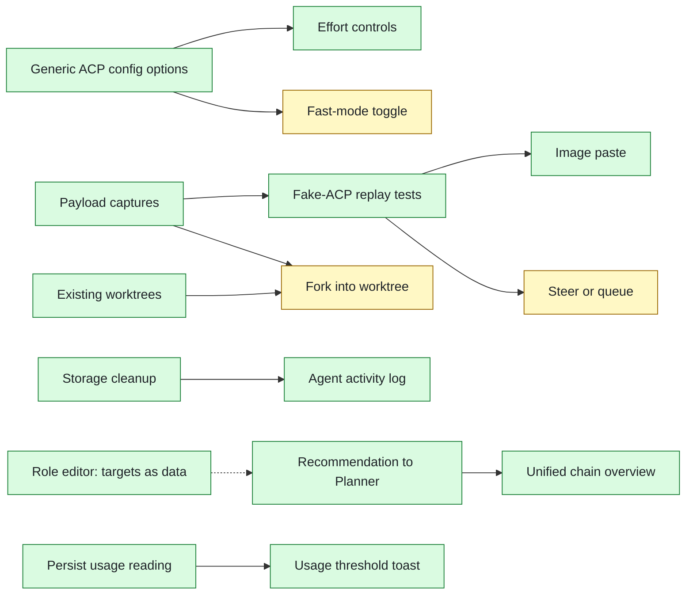

# DCTerminal Opportunity Map

What the app could do next, grounded in its code, with delivery status.

- **First review:** 2026-10-10 (read-only feature discovery)
- **Status as of:** 2026-10-10, `master` at `608997c` (after PR #28)
- **Delivered in:** PRs #17–#28
- **Tests:** 659 UI e2e tests (`npm run e2e:ui`) and 492 Rust tests
- **HTML version:** [OPPORTUNITY-MAP.html](OPPORTUNITY-MAP.html)

The first review found three areas: Claude capabilities the app ignored, the open ends of the Eagle-Eye hand-off chain, and no visibility into what agents do under full permissions. All three are now covered. What remains is a short list of experimental and strategic items.

## Delivery status: 11 of 18 shipped

| Status | Count |
|---|---|
| ✅ Shipped | 11 |
| 🟦 Partly | 1 (mode switching) |
| ⬜ Not built | 6 |

Every item from the Quick and Medium-term lanes is merged, plus the main Strategic item and the storage cleanup the activity log depended on. The open items are mostly experimental, or waiting on a decision.

| PR | What it delivered |
|---|---|
| #17–#21 | Claude-first work, effort controls, Recommendation/Audit → Planner, grid view, persistence fixes |
| #22 | Slash commands and skills in the composer |
| #23 | Image paste in chat and pad |
| #24 | Eagle-Eye chain overview |
| #25 | Storage cleanup, terminal This-turn snapshots, polish |
| #26 | Role editor, hand-off targets as role data |
| #27 | Agent activity log |
| #28 | 35 bug fixes, verdict routing and rounds, live overview, full e2e and fake-agent test suites |

## Workflow: the chain's front door is open, and work can go back

```
Recommendation / Codebase Audit ──► Planner ──► Plan Reviewer ──► Implementer ──► PR Reviewer
   (new, #17–#21)                      ▲              │                ▲              │
                                       └─ send back ──┘                └─ send back ──┘
                                          (round N+1)                     (round N+1)
```

- **Front door:** Recommendation and Codebase Audit hand a selected card or finding to a pre-filled Planner tab (`src/handoff/transitions.ts`, `mapReportToPlanner`).
- **Verdicts pick the next step:**
  - Plan Reviewer approved → "Next: Send to Implementer". Revision needed → "Send back to Planner".
  - PR Reviewer changes requested → "Send back to Implementer". Approved → "Chain complete".
- **Loop-backs stay in the chain:** sending back reuses the chain's own tab with a follow-up message, or opens a new tab tagged on the chain if the original is gone. Each loop-back starts a new round (`src/handoff/routing.ts`, `chain_loop_back`).
- **Task Type** carries from the Planner to the Implementer.
- **Hand-offs stay user-triggered:** nothing sends or opens on its own.

## The Claude adapter: what the app uses now

At the first review the app acted on 4 of 12 capabilities. It now uses 8.

| Capability | Status | Notes |
|---|---|---|
| `configOptions.model` | ✅ Used | Model picker, live switch via `set_config_option` |
| `loadSession` | ✅ Used | Continue after restart; reattach after a webview reload (#28) |
| `usage_update` · `_claude/rateLimit` | ✅ Used | 5h / 7d limits and context %, saved to `usage.json`, with a limit toast |
| `ExitPlanMode` | ✅ Used | Planner plan card with Send to … / Keep planning |
| `configOptions.effort` | ✅ Used (was ignored) | Per-role default, live switch in the tab header (#17–#21) |
| `promptCapabilities.image` | ✅ Used (was ignored) | Paste or drop screenshots (#23) |
| `available_commands_update` | ✅ Used (was ignored) | Slash autocomplete; `/model`, `/login`, `/logout` blocked (#22) |
| `configOptions.mode` | 🟦 Partly | Set per role at start; can't change mid-session |
| `configOptions.fast` | ⬜ Ignored | Cost on a subscription still unverified |
| `promptQueueing` · `steering` | ⬜ Ignored | Drafting during a turn works; nothing is queued or steered |
| `sessionCapabilities.fork` | ⬜ Ignored | Branch a conversation into a new session |
| `additionalDirectories` | ⬜ Ignored | More than one folder per session |

## Opportunity board

Grouped by horizon, not ranked.

### Quick

| Opportunity | Status | Where |
|---|---|---|
| Effort controls | ✅ Shipped #17–#21 | `acp/client.rs` `apply_effort`, SettingsPage |
| Fast-mode toggle | ⬜ Not built | `configOptions.fast`; held back until its cost is confirmed |
| Recommendation / Audit → Planner | ✅ Shipped #17–#21 | `handoff/transitions.ts`, `map.ts` `mapReportToPlanner` |
| Up-arrow history survives restart | ✅ Shipped #17–#21 | `useScratchPads.ts`; newest-first order fixed in #28 |
| Last usage reading + threshold toast | ✅ Shipped #17–#21 | `usage.rs`, `usage/limits.ts` |
| Small persistence fixes (Recent folders, Accepted marks) | ✅ Shipped #17–#21 | `pty/mod.rs` `remember_folder`, `changes/acceptedStore.ts` |

### Medium-term

| Opportunity | Status | Where |
|---|---|---|
| Agent activity log | ✅ Shipped #27 | `activity_store.rs`, ActivityPanel |
| Image paste in chat and pad | ✅ Shipped #23 | `attachments.rs`, `useChatImages` |
| Slash commands in the composer | ✅ Shipped #22 | `composer/slashCommands.ts` |
| Auto-snapshot terminal tabs on pad Send | ✅ Shipped #25 | `turnSnapshot.ts` |
| Finish the role editor | ✅ Shipped #26 | `roles/editor.rs`, `RoleEditor.tsx` |

### Strategic

| Opportunity | Status | Where |
|---|---|---|
| One overview for chains and pipelines | ✅ Shipped #24, #28 | `chain_runs.rs`, PipelineOverview, `chain-run-updated` event |
| Fork a chat into a worktree | ⬜ Not built | `sessionCapabilities.fork`, `worktree.rs` |

### Experimental

| Opportunity | Status | Notes |
|---|---|---|
| Steer or queue while busy | ⬜ Not built | Drafting during a turn works now |
| GitHub context for PR Reviewer | ⬜ Not built | Out of scope unless approved |
| Terminal scrollback persistence | ⬜ Not built | Value unclear given `/resume` |
| Extra folders per session | ⬜ Not built | `additionalDirectories` |

## Feature cards

### Effort and fast-mode controls: 🟦 Partly
- **Shipped:** per-role effort in Settings › Models, a live effort switch in each Claude tab header, and the effort applied at session start (`role_effort`, `acp_set_effort`).
- **Still open:** fast mode. Its usage cost on a subscription is unverified.
- **Next step:** confirm the cost, then reuse the effort plumbing. It's the same `session/set_config_option` call with another option id.

### Recommendation / Audit → Planner: ✅ Shipped
- Both roles can send to Planner and Developer.
- The dialog offers "Selected card or finding" and fills Title, Task Type, Request and context.
- A palette command sends to the Planner.
- Hand-off targets became role data with the role editor (#26).

### Agent activity log: ✅ Shipped
- Per-tab log of shell, read, write, fetch and MCP calls, with status, decision, filters and Clear.
- Secrets in commands, URLs and `*_SECRET_*` values are masked (#27, hardened in #28).
- Storage cleanup shipped first (#25), so the log is size-capped and rotated.

### Image paste: ✅ Shipped
- Paste or drop images in the chat composer and pad: up to 5 images, 5 MB each, stored in app data.
- In a `---` chain, images go with the first step only. Cursor chats refuse images.
- Verified live on claude1: Claude answered "Red" for a red test image.

### One overview for chains and pipelines: ✅ Shipped
- **#24:** chain overview with the original request and, for each stage, its tab, status, handed-in text and verdict, plus Jump to tab. Includes the PR Reviewer stage.
- **#28:**
  - The verdict picks the primary action.
  - Send back reuses the chain's tab and starts a new round.
  - The label and overview show the round number and verdict history.
  - Task Type is carried to the Implementer.
  - The overview updates on a `chain-run-updated` event, not a 4 s poll.
- It stays a view and never starts or sends anything on its own.

## What unlocked what

The three foundations are in place: generic config options, fake-agent replay tests, and storage cleanup.



## Storage: what used to grow without limit

Every store the first review flagged is now bounded. "Clean up now" in Settings › Data runs the same sweep on demand.

| File | Holds | Limit now | Status |
|---|---|---|---|
| `transcripts/<tab>.json` | Saved chat transcripts | 30 files, 500k chars each | Bounded |
| `handoffs.json` | Hand-off plans and sidecars | 100 records, sidecars pruned | Bounded |
| `prompts.json` | Saved prompts, recent sends | 500 prompts, 50 recent | Bounded |
| `changes/<tab>/` | Git snapshots per tab | Pruned at startup for closed tabs | Bounded |
| `scratch.json` | Pads for every tab | Pruned for closed tabs at startup (#25); was test-only | Bounded |
| `state.json` · `pipeline_runs` | Pipeline and chain runs | `prune_pipeline_runs` (#25); was never pruned | Bounded |
| `logs/permission-payloads.jsonl` | Opt-in request capture | Rotated at a size cap (#25); had no rotation | Bounded |
| `*.corrupt-*` · `*.bak` | Recovered or backup files | Swept after an age limit; symlinks never followed (#25, #28) | Bounded |
| `activity/<tab>.jsonl` | Agent activity log (new) | Capped and rotated per tab (#27) | Bounded |
| `usage.json` | Last 5h / 7d reading | Saved on change (#17–#21); was memory only | Saved |

## What's left, and what to check first

Seven items remain (6 not built, 1 partly). None blocks daily use.

1. **Fast-mode toggle.** This is the smallest item.
   - Confirm its usage cost on the subscription.
   - Decide whether it is hidden by default.
   - Plan. The effort plumbing already does most of the work.
2. **Switch mode mid-session.**
   - Capture a live `set_config_option` for mode on adapter 0.88.
   - Decide which roles may switch, and to what.
   - Plan.
3. **Fork into a worktree.**
   - Capture `session/fork` on the Mac.
   - Add the capture to the fake-agent fixtures.
   - Plan the worktree flow.
4. **Steer or queue while busy.**
   - Capture the steering `_meta` shape.
   - Decide queue or steer from the user's side.
   - Plan.
5. **Extra folders, GitHub context, scrollback.** Each needs a yes first.
   - Extra folders: which roles need more than one repo?
   - GitHub context: approve reading PRs, or keep it out?
   - Scrollback: is it worth it, given `/resume`?

### Constraints respected
- No token or dollar tracking.
- No writes to `~/.claude`, `~/.cursor` or repos.
- Hand-offs stay user-triggered.
- No orchestrator or fleet.
- GitHub auto-fill only with approval.

---

The first review also found a bug: the start screen showed "Cursor CLI was not found." on a Claude-first setup. It's fixed; the message now shows only while Cursor is selected.
