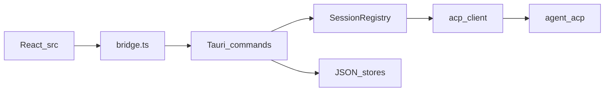
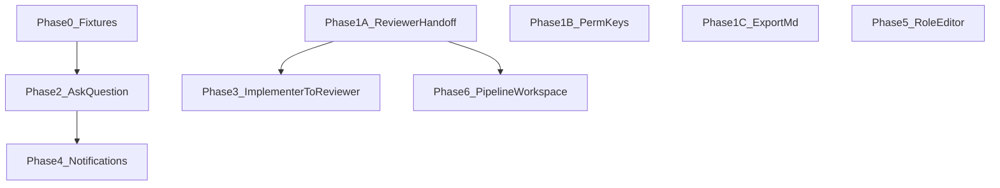

# DCTerminal — feature roadmap implementation plan

> **For:** Engineers and agents continuing this repo  
> **Source:** Feature discovery report (2026-10-07)  
> **Spec:** [DCTerminal-Project-Blueprint.md](../DCTerminal-Project-Blueprint.md)  
> **Checklist:** [TASKS.md](../TASKS.md)  
> **Status:** [PROGRESS.md](../PROGRESS.md)

## Goal

Implement the highest-value gaps identified after the F1–F9 improvements pass: complete the **plan → implement → review** pipeline, restore blocking **ACP question** UX, and add operator polish (export, keyboard permissions), then medium-term and foundation work.

**Constraints (unchanged):** Solo local tool; no cloud backend; never write `~/.cursor` (blueprint §31). Run `npm run check` before merge. Update PROGRESS/TASKS when items land.

## Architecture reference

Blocking agent→client flows today: **permission** and **plan** ([`src-tauri/src/commands/agent_requests.rs`](../../src-tauri/src/commands/agent_requests.rs)). **Question** should follow the same pattern.

## Suggested PR sequence

| PR | Scope |
|----|--------|
| PR-1 | Phase 1A + 1B (Reviewer hand-off + permission keys) |
| PR-2 | Phase 1C (transcript export) |
| PR-3 | Phase 0 fixtures + Phase 2 `ask_question` |
| PR-4 | Phase 3 Implementer → Reviewer hand-off |
| PR-5+ | Phase 4 items à la carte |
| PR-6 | Phase 5 role editor (split if large) |

**First slice:** Phase 1A — smallest diff; mapping already tested in `src/handoff/map.test.ts`.

---

## Phase 0 — Investigation & fixtures (0.5–1 day)

**Goal:** Remove protocol guesswork before question UI work.

| Task | Action | Output |
|------|--------|--------|
| 0.1 | On logged-in CLI, run a session that triggers `cursor/ask_question` | NDJSON snippet under `fixtures/acp/` |
| 0.2 | Document request/response fields | [`docs/acp-observed.md`](../acp-observed.md) |
| 0.3 | Fake-agent scenario in `tools/fake-acp-agent/` | Deterministic test input |
| 0.4 | Mac smoke from PROGRESS “Not MVP-done yet” | Short note in PROGRESS or TESTING |

**Exit criteria:** Fixture + fake agent path exists; macOS smoke checklist started or waived with reason.

---

## Phase 1 — Quick wins: pipeline + operator UX (2–4 days)

### 1A — Hand off plan to PR Reviewer

**Problem:** `mapHandoff` supports `role_pr_reviewer` in tests; UI only offers Implementer/Developer.

**Implementation:**

1. Extend `HANDOFF_TARGETS` in [`src/handoff/map.ts`](../../src/handoff/map.ts) to include `role_pr_reviewer`.
2. [`src/components/HandoffDialog.tsx`](../../src/components/HandoffDialog.tsx) — add Reviewer to `TARGETS`.
3. [`src/tabChrome.ts`](../../src/tabChrome.ts) — palette `Hand off plan to PR Reviewer…` (Planner-only, same as other hand-offs).
4. [`src/StartupForm.tsx`](../../src/StartupForm.tsx) — `runPaletteAction` + terminal/session entry points.
5. [`src/components/SessionCards.tsx`](../../src/components/SessionCards.tsx) / `HandoffActions` — third button if applicable.
6. Tests: `handoff/map.test.ts`, `HandoffDialog.test.tsx`, `tabChrome.test.ts`, StartupForm palette tests.
7. Docs: README hand-off bullet; FR-099 note in TASKS.

**Complexity:** Low | **Risk:** Low

### 1B — Permission card keyboard shortcuts

1. [`src/PermissionCard.tsx`](../../src/PermissionCard.tsx) — `A` / `R` / `Esc` when card mounted (map to first allow/reject option ids).
2. Avoid double-fire with [`src/useAppShortcuts.ts`](../../src/useAppShortcuts.ts).
3. Vitest: key events on card.

**Complexity:** Low | **Risk:** Low

### 1C — Export transcript to Markdown (FR-071)

1. New [`src/export/transcriptMd.ts`](../../src/export/transcriptMd.ts) — formatter + Vitest golden.
2. Palette **Export transcript…** using `transcript_load` + `getTab`; save via Tauri dialog (frontend-first).
3. Disable when no transcript; warn or cap on huge exports.

**Complexity:** Low–Medium | **Risk:** Low

**Phase 1 exit criteria:** All three shipped; `npm run check` green.

---

## Phase 2 — Blocking ACP: `cursor/ask_question` (3–5 days)

**Goal:** Replace auto-cancel with operator choices; align F1/F2 “needs you” with real question state.

**Depends on:** Phase 0 fixture.

**Backend** ([`src-tauri/src/commands/agent_requests.rs`](../../src-tauri/src/commands/agent_requests.rs)):

1. Add `QUESTION_REQUEST_EVENT`, `QuestionRequestEvent` (jsonRpcId, title, prompt, choices).
2. `stage_question_request` — queue on session; emit event; return pending reply.
3. `respond_question_request` — complete JSON-RPC reply.
4. Wire from ACP request router (same path as plan staging); remove default cancel for live sessions where appropriate.
5. On tab close: cancel pending questions like permissions.

**Frontend:**

1. [`src/bridge.ts`](../../src/bridge.ts) — listen + respond APIs.
2. New `QuestionCard.tsx` — choices + Skip/Cancel.
3. Session shell — render alongside permission/plan UI.
4. [`src/notify/agentNotify.ts`](../../src/notify/agentNotify.ts) + tab status — question state, not only trailing `?` heuristic.

**Tests:** Rust fixture; fake ACP from Phase 0; Vitest card.

**Complexity:** Medium | **Risk:** Medium (protocol drift)

---

## Phase 3 — Implementer → PR Reviewer hand-off (2–3 days)

**Goal:** Complete J2 without re-opening the Planner tab.

**Depends on:** Phase 1A (shared hand-off UX).

1. Extend [`HandoffSource`](../../src/handoff/map.ts) / `handoffBlockReason` — allow finished **Implementer** (not in-flight).
2. Map Implementer form keys → Reviewer `originalTask` / `approvedPlan` (verify in [`seed/roles.seed.json`](../../seed/roles.seed.json)).
3. Source: tab form + [`src-tauri/src/store/state_types.rs`](../../src-tauri/src/store/state_types.rs) snapshot.
4. UI: palette + session action; `handoff_save`; **From Implementer: …** link.
5. Tests in `handoff/map.test.ts`.

**Complexity:** Medium | **Risk:** Medium (field mapping)

---

## Phase 4 — Medium-term operator features (parallelizable)

Pick order by daily pain (~2–4 days each).

| ID | Feature | Main touchpoints |
|----|---------|------------------|
| 4A | Terminal notifications (extend F1) | `src/notify/useAgentNotifications.ts`, `src/terminal/activity.ts` |
| 4B | Composer input history | Composer in `StartupForm.tsx` / session view; per-tab ring buffer |
| 4C | Log drawer (FR-080) | Supervisor stderr + optional redacted trace; status bar entry |
| 4D | Workspaces + split/worktree | `src-tauri/src/store/workspace_store.rs`, `WorkspacesDialog.tsx`, persist `layout` + tab `worktree` |

---

## Phase 5 — Role editor & custom roles (1–2 weeks)

**Goal:** FR-021 / FR-091 without hand-editing `roles.json`.

1. **Rust:** `save_role`, `reset_builtin_role`; later `duplicate_role` / `delete_role` (non-built-in) on [`RolesStore`](../../src-tauri/src/store/roles_store.rs); validate via `template` module.
2. **UI:** Settings → Roles — edit template, preview schema, Save / Reset built-in.
3. **Follow-up:** import/export JSON (FR-027).

**Complexity:** High | **Risk:** Medium — rely on atomic JSON + `.bak`.

---

## Phase 6 — Strategic (defer until Phases 1–3 done)

- **Pipeline workspace preset** — three draft tabs (Planner / Implementer / Reviewer), one `cwd`.
- **`session/list` browser** — user-triggered only; see [`docs/cursor-cli-history.md`](../cursor-cli-history.md).
- **Release** — signing/notarization; optional version check per [`docs/RELEASE.md`](../RELEASE.md).

---

## MVP / quality gate (ongoing)

Before tagging v0.1:

- [ ] §21 acceptance in [`docs/MVP-FINISH.md`](../MVP-FINISH.md): four concurrent role tabs (Windows + macOS).
- [ ] `npm run check` on Node 22+.
- [ ] TASKS milestones: T0.2 RAM probe, fake ACP scenarios, store corruption tests — as capacity allows.

---

## Dependency graph

---

## Out of scope (explicit)

- GitHub/Jira auto-fill (blueprint P3) unless separately approved.
- AI summarization / NL reporting.
- Cloud sync, multi-user, token/cost panels (IMPROVEMENTS-PLAN out of scope).

---

## Tracking checklist

- [~] Phase 0 — fixtures & smoke (ask_question fixture + fake-agent path TBD)
- [x] Phase 1A — PR Reviewer hand-off
- [x] Phase 1B — Permission keyboard shortcuts
- [x] Phase 1C — Transcript export
- [x] Phase 2 — `ask_question` UI
- [x] Phase 3 — Implementer → Reviewer hand-off
- [ ] Phase 4A–4D — medium-term (individual boxes)
- [ ] Phase 5 — Role editor
- [ ] Phase 6 — strategic items
- [ ] MVP §21 acceptance
